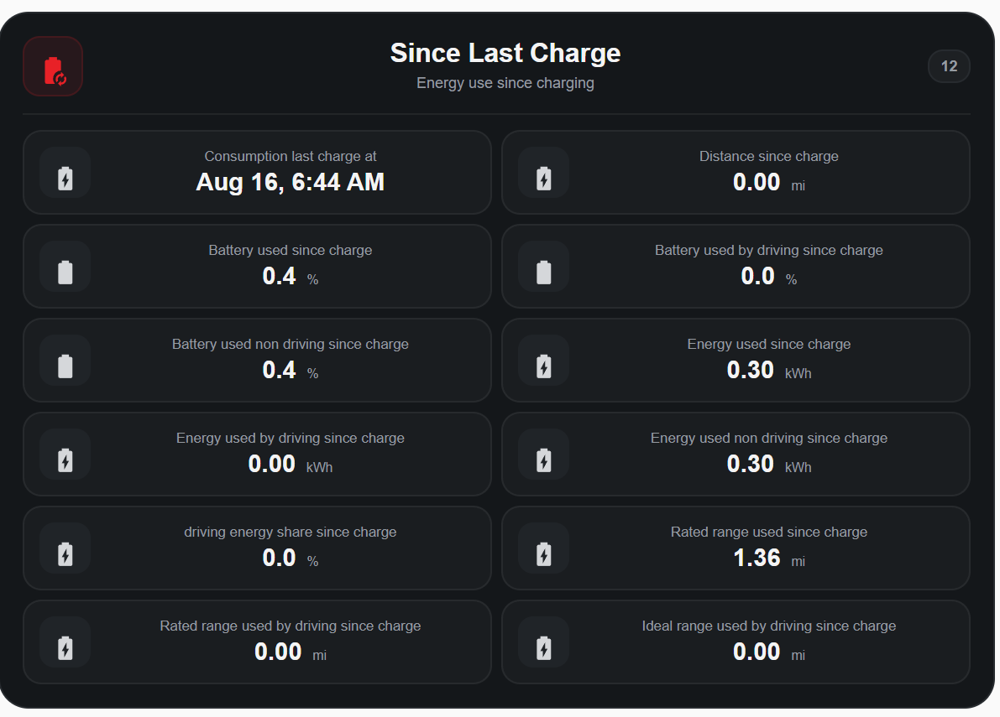

# Tessie Drive Stats — Card Examples

This gallery shows the Tesla-inspired Home Assistant dashboard cards built with Tessie Drive Stats entities.

The screenshots below are the actual cards from the current example dashboard. File names match the visible card titles instead of timestamp-based screenshot names.

> **Privacy note:** Screenshots can contain addresses, navigation destinations, VINs, GPS coordinates, access tokens, or other personal information. Review and redact location data before publishing new examples.

## Dashboard Header

Vehicle name plus compact status modules for vehicle state, battery level, range, charging state, and outside temperature.

## Vehicle

Live vehicle information including connection state, battery/range, energy remaining, phantom drain, temperatures, odometer, and lifetime energy.

## Charging

Current charging state, charge limit, charge rate, charger power, and time to full.

## Driving — Today

Today's drive count, miles, energy, drive time, efficiency, battery use, AP/FSD miles, speeds, and longest drive.

## Driving — This Week

## Driving — This Month

## Driving — This Year

## Last Drive

Most recent completed trip with distance, time, energy, efficiency, AP/FSD, speed, battery usage, temperatures, range use, route details, and path-point count.

## Drive Energy Factors

A focused consumption-context card for understanding the conditions around the most recent drive. It combines actual battery use, energy consumed, efficiency, and battery-per-mile with outside/cabin temperature, speed, AP/FSD use, battery-pack temperatures, and month/year efficiency comparisons.

The comparison indicators are intended as **context**, not as a claim that any single temperature, speed, or driving condition caused a specific percentage of battery loss.

## Since Last Charge

Battery, energy, and range consumption since the most recent charge, including driving vs. non-driving use.

## Battery

Battery health, degradation, current/original capacity, maximum range, module temperatures, and long-term capacity/range changes.

## Lifetime

Version 0.4.0 adds a Tesla-style Lifetime card that separates **true vehicle lifetime counters** from **Tessie recorded lifetime** history. The public example uses a configurable entity prefix so it can be reused with any vehicle.

**[View the Lifetime card YAML →](lifetime-card.yaml)**

The card includes vehicle odometer and lifetime energy, recorded driving/AP-FSD totals, charging and Supercharging totals, idle/vampire-drain totals, and battery-history changes. Once a public-safe screenshot is available, it can be added here as `screenshots/lifetime.png`.

## Idle — Today

## Idle — This Week

## Idle — This Month

## Idle — This Year

## Last Idle

Most recent parked period including duration, energy, battery change, Sentry/climate share, range use, and location.

## Charging Cost

Charging cost totals plus the most recent charge cost, energy added, and location.

## Supercharging

Supercharger sessions, energy, costs, last Supercharger details, and invoice access information when available.

## Tires

All four tire pressures plus low-pressure warning binary sensors.

## Navigation

Active Tesla navigation destination, distance, ETA, traffic delay, and estimated battery at arrival.

## Software

Tesla software version, update state/progress, firmware alerts, latest alert timestamp, and observed wakeups.

## Screenshot file naming

Use short, descriptive, lowercase filenames that match the visible card title. Examples:

- `vehicle.png`
- `driving-this-month.png`
- `last-drive.png`
- `drivefactors.png`
- `since-last-charge.png`
- `lifetime.png`
- `idle-this-year.png`
- `charging-cost.png`
- `software.png`

Avoid timestamp-based names such as `Screenshot 2026-08-16 120542.png`.
