# Tessie Drive Stats — Card Examples

This gallery shows the Tesla-inspired Home Assistant dashboard cards built with Tessie Drive Stats entities.

The screenshots below are the actual cards from the current example dashboard. File names match the visible card titles instead of timestamp-based screenshot names.

> **Privacy note:** Screenshots can contain addresses, navigation destinations, VINs, GPS coordinates, access tokens, or other personal information. Review and redact location data before publishing new examples.

## Dashboard Header

Vehicle name plus compact status modules for vehicle state, battery level, range, charging state, and outside temperature.

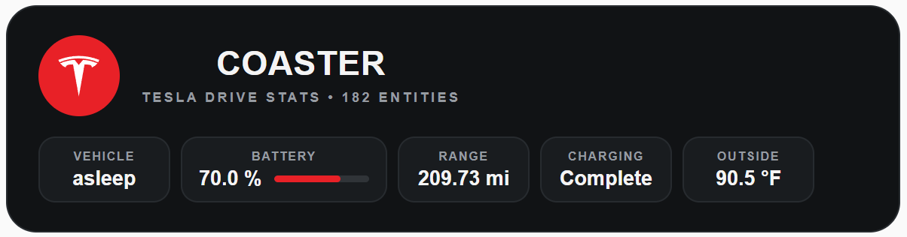

<details>
<summary>Copy YAML</summary>
  
```yaml

type: custom:button-card
grid_options:
  columns: 12
  rows: auto
show_name: false
show_icon: false
show_state: false
show_label: false
triggers_update:
  - sensor.car_coaster_vehicle_status
  - sensor.car_coaster_battery_level_current
  - sensor.car_coaster_battery_range_current
  - sensor.car_coaster_charging_state_current
  - sensor.car_coaster_outside_temperature_current
tap_action:
  action: none
styles:
  card:
    - width: 100%
    - min-width: 0
    - padding: 0
    - border: none
    - box-shadow: none
    - background: transparent
  grid:
    - grid-template-areas: '"main"'
    - grid-template-columns: minmax(0, 1fr)
    - grid-template-rows: auto
custom_fields:
  main: |
    [[[
      const get = id => states[id];

      const show = (id, unit = true) => {
        const e = get(id);
        if (!e || ['unknown','unavailable',''].includes(e.state)) return '—';
        return `${e.state}${unit && e.attributes?.unit_of_measurement ? ` ${e.attributes.unit_of_measurement}` : ''}`;
      };

      const batteryRaw = Number(get('sensor.car_coaster_battery_level_current')?.state);
      const battery = Number.isFinite(batteryRaw) ? Math.max(0, Math.min(100, batteryRaw)) : 0;

      return `
        <style>
          .header {
            width: 100%;
            min-width: 0;
            display: grid;
            grid-template-columns: minmax(220px,1fr) auto;
            gap: 18px;
            align-items: center;
            padding: 17px 18px;
            box-sizing: border-box;
            border-radius: 18px;
            background: #111315;
            border: 1px solid #272b2f;
            color: #f4f4f4;
            font-family: Arial, Helvetica, sans-serif;
          }

          .brand {
            min-width: 0;
            display: flex;
            align-items: center;
            gap: 13px;
          }

          .logo {
            width: 48px;
            height: 48px;
            display: flex;
            align-items: center;
            justify-content: center;
            flex: 0 0 auto;
            border-radius: 50%;
            background: #e82127;
          }

          .logo ha-icon {
            width: 29px;
            height: 29px;
            color: white;
          }

          .name {
            font-size: 23px;
            line-height: 1;
            font-weight: 650;
            letter-spacing: .3px;
          }

          .sub {
            margin-top: 6px;
            font-size: 8px;
            font-weight: 600;
            letter-spacing: 1.55px;
            text-transform: uppercase;
            color: #969ba1;
          }

          .status {
            display: flex;
            flex-wrap: wrap;
            justify-content: flex-end;
            gap: 6px;
          }

          .module {
            min-width: 82px;
            padding: 7px 10px;
            box-sizing: border-box;
            border-radius: 10px;
            background: #191c1f;
            border: 1px solid #272b2f;
          }

          .label {
            margin-bottom: 3px;
            font-size: 7px;
            font-weight: 650;
            letter-spacing: .85px;
            text-transform: uppercase;
            color: #969ba1;
          }

          .value {
            overflow: hidden;
            text-overflow: ellipsis;
            white-space: nowrap;
            font-size: 12px;
            line-height: 1;
            font-weight: 650;
          }

          .battery {
            min-width: 116px;
          }

          .battery-row {
            display: flex;
            align-items: center;
            justify-content: space-between;
            gap: 7px;
          }

          .track {
            width: 54px;
            height: 4px;
            overflow: hidden;
            border-radius: 10px;
            background: #303438;
          }

          .fill {
            width: ${battery}%;
            height: 100%;
            border-radius: inherit;
            background: ${battery <= 20 ? '#ff514b' : '#e82127'};
          }

          @media (max-width: 700px) {
            .header {
              grid-template-columns: minmax(0,1fr);
              gap: 12px;
            }
            .status {
              justify-content: flex-start;
            }
          }
        </style>

        <div class="header">
          <div class="brand">
            <div class="logo">
              <ha-icon icon="phu:tesla-icon"></ha-icon>
            </div>
            <div>
              <div class="name">COASTER</div>
              <div class="sub">Tessie Drive Stats</div>
            </div>
          </div>

          <div class="status">
            <div class="module">
              <div class="label">Vehicle</div>
              <div class="value">${show('sensor.car_coaster_vehicle_status', false)}</div>
            </div>

            <div class="module battery">
              <div class="label">Battery</div>
              <div class="battery-row">
                <div class="value">${show('sensor.car_coaster_battery_level_current')}</div>
                <div class="track"><div class="fill"></div></div>
              </div>
            </div>

            <div class="module">
              <div class="label">Range</div>
              <div class="value">${show('sensor.car_coaster_battery_range_current')}</div>
            </div>

            <div class="module">
              <div class="label">Charging</div>
              <div class="value">${show('sensor.car_coaster_charging_state_current', false)}</div>
            </div>

            <div class="module">
              <div class="label">Outside</div>
              <div class="value">${show('sensor.car_coaster_outside_temperature_current')}</div>
            </div>
          </div>
        </div>
      `;
    ]]]


```

</details>

---

## Vehicle

Live vehicle information including connection state, battery/range, energy remaining, phantom drain, temperatures, odometer, and lifetime energy.

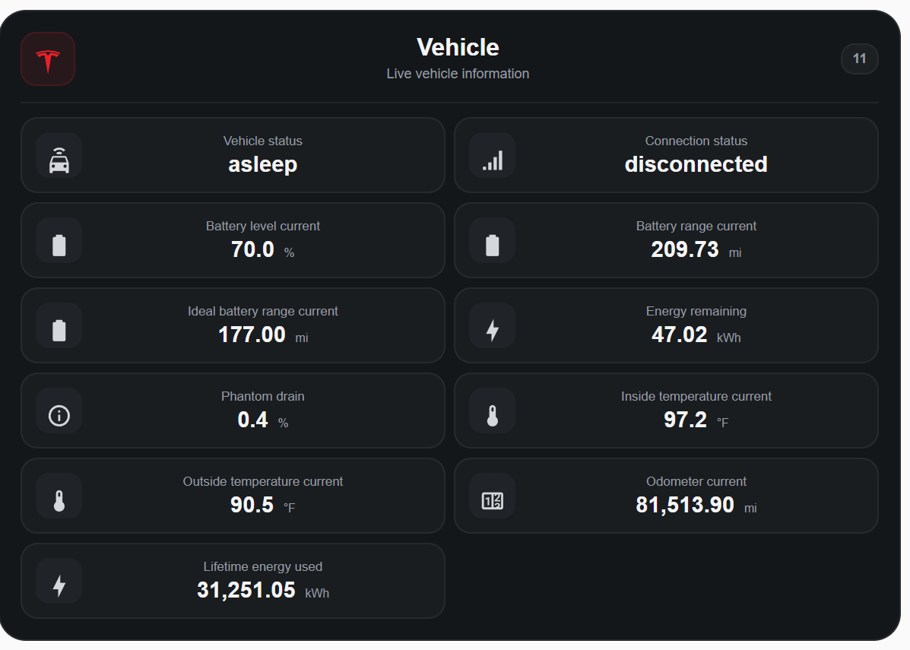

<details>
<summary>Copy YAML</summary>
  
```yaml

type: custom:button-card
grid_options:
  rows: auto
show_name: false
show_icon: false
show_state: false
show_label: false
triggers_update:
  - sensor.car_coaster_vehicle_status
  - sensor.car_coaster_connection_status
  - sensor.car_coaster_battery_level_current
  - sensor.car_coaster_battery_range_current
  - sensor.car_coaster_ideal_battery_range_current
  - sensor.car_coaster_energy_remaining
  - sensor.car_coaster_phantom_drain
  - sensor.car_coaster_inside_temperature_current
  - sensor.car_coaster_outside_temperature_current
  - sensor.car_coaster_odometer_current
  - sensor.car_coaster_lifetime_energy_used
tap_action:
  action: none
hold_action:
  action: none
styles:
  card:
    - width: 100%
    - min-width: 0
    - padding: 12px
    - box-sizing: border-box
    - overflow: hidden
    - border-radius: 16px
    - background: '#14171a'
    - border: 1px solid "#272b2f"
    - box-shadow: none
  grid:
    - grid-template-areas: '"main"'
    - grid-template-columns: minmax(0, 1fr)
    - grid-template-rows: auto
    - width: 100%
  custom_fields:
    main:
      - width: 100%
      - min-width: 0
custom_fields:
  main: |
    [[[
      const ids = ["sensor.car_coaster_vehicle_status", "sensor.car_coaster_connection_status", "sensor.car_coaster_battery_level_current", "sensor.car_coaster_battery_range_current", "sensor.car_coaster_ideal_battery_range_current", "sensor.car_coaster_energy_remaining", "sensor.car_coaster_phantom_drain", "sensor.car_coaster_inside_temperature_current", "sensor.car_coaster_outside_temperature_current", "sensor.car_coaster_odometer_current", "sensor.car_coaster_lifetime_energy_used"];

      const suffix = id => {
        if (id.startsWith('binary_sensor.car_coaster_')) {
          return id.slice('binary_sensor.car_coaster_'.length);
        }
        return id.slice('sensor.car_coaster_'.length);
      };

      const label = id => {
        let name =
          states[id]?.attributes?.friendly_name ||
          suffix(id).replace(/_/g, ' ');

        return name
          .replace(/^Coaster\s*/i, '')
          .replace(/^Car Coaster\s*/i, '')
          .replace(/driVINg/gi, 'driving');
      };

      const iconFor = id => {
        const name = suffix(id);

        if (id.startsWith('binary_sensor.')) return 'mdi:car-tire-alert';
        if (name.includes('ap_fsd')) return 'mdi:steering';
        if (name.includes('tire')) return 'mdi:car-tire-alert';
        if (name.includes('battery_health')) return 'mdi:battery-heart-variant';
        if (name.includes('degradation')) return 'mdi:battery-alert-variant-outline';
        if (name.includes('battery')) return 'mdi:battery';
        if (name.includes('supercharger')) return 'mdi:ev-station';
        if (name.includes('charging')) return 'mdi:ev-plug-tesla';
        if (name.includes('charge')) return 'mdi:battery-charging';
        if (name.includes('cost') || name.includes('invoice')) return 'mdi:currency-usd';
        if (name.includes('energy')) return 'mdi:lightning-bolt';
        if (name.includes('efficiency')) return 'mdi:gauge';
        if (name.includes('speed')) return 'mdi:speedometer';
        if (name.includes('time')) return 'mdi:clock-outline';
        if (name.includes('drives') || name.includes('sessions')) return 'mdi:counter';
        if (name.includes('miles') || name.includes('range') || name.includes('distance')) return 'mdi:road-variant';
        if (name.includes('temperature') || name.includes('_temp_')) return 'mdi:thermometer';
        if (name.includes('sentry')) return 'mdi:shield-car';
        if (name.includes('climate')) return 'mdi:fan';
        if (name.includes('navigation')) return 'mdi:navigation-variant';
        if (name.includes('location') || name.includes('destination') || name.endsWith('_start')) return 'mdi:map-marker';
        if (name.includes('software')) return 'mdi:update';
        if (name.includes('firmware') || name.includes('alert')) return 'mdi:alert-outline';
        if (name.includes('odometer')) return 'mdi:counter';
        if (name.includes('connection')) return 'mdi:signal';
        if (name.includes('wake')) return 'mdi:weather-sunset-up';
        if (name.includes('vehicle_status')) return 'mdi:car-connected';
        return 'mdi:information-outline';
      };

      const format = id => {
        const entity = states[id];

        if (!entity) {
          return { value: '—', unit: '', cls: 'muted' };
        }

        const raw = String(entity.state ?? '').trim();

        if (!raw || raw === 'unknown' || raw === 'unavailable') {
          return { value: '—', unit: '', cls: 'muted' };
        }

        if (id.startsWith('binary_sensor.')) {
          if (raw === 'on') return { value: 'LOW', unit: '', cls: 'danger' };
          if (raw === 'off') return { value: 'NORMAL', unit: '', cls: 'good' };
        }

        const unit = entity.attributes?.unit_of_measurement || '';
        const deviceClass = entity.attributes?.device_class || '';
        const number = Number(raw);

        if (
          deviceClass === 'timestamp' ||
          (raw.includes('T') && !Number.isFinite(number))
        ) {
          const date = new Date(raw);
          if (!Number.isNaN(date.getTime())) {
            return {
              value: date.toLocaleString(undefined, {
                month: 'short',
                day: 'numeric',
                hour: 'numeric',
                minute: '2-digit'
              }),
              unit: '',
              cls: ''
            };
          }
        }

        if (Number.isFinite(number)) {
          if (unit === 'USD' || unit === '$') {
            return {
              value: `$${number.toLocaleString(undefined, {
                minimumFractionDigits: 2,
                maximumFractionDigits: 2
              })}`,
              unit: '',
              cls: ''
            };
          }

          if (unit === 'min') {
            const absolute = Math.abs(number);
            if (absolute >= 1440) {
              const days = Math.floor(absolute / 1440);
              const hours = Math.floor((absolute % 1440) / 60);
              return {
                value: `${number < 0 ? '-' : ''}${days}d ${hours}h`,
                unit: '',
                cls: ''
              };
            }
            if (absolute >= 60) {
              const hours = Math.floor(absolute / 60);
              const minutes = Math.round(absolute % 60);
              return {
                value: `${number < 0 ? '-' : ''}${hours}h ${minutes}m`,
                unit: '',
                cls: ''
              };
            }
          }

          let decimals = 1;
          if (unit === 'kWh' || unit === 'mi') decimals = 2;
          if (unit === 'Wh/mi' || unit === 'kW') decimals = 0;
          if (!unit) decimals = Number.isInteger(number) ? 0 : 1;

          return {
            value: number.toLocaleString(undefined, {
              minimumFractionDigits: decimals,
              maximumFractionDigits: decimals
            }),
            unit,
            cls: number < 0 ? 'danger' : ''
          };
        }

        return { value: raw, unit: '', cls: '' };
      };

      const metrics = ids.map(id => {
        const data = format(id);

        return `
          <div class="metric">
            <div class="metric-icon">
              <ha-icon icon="${iconFor(id)}"></ha-icon>
            </div>
            <div class="metric-copy">
              <div class="metric-label">${label(id)}</div>
              <div class="metric-value ${data.cls}">
                ${data.value}
                ${data.unit ? `<span class="unit">${data.unit}</span>` : ''}
              </div>
            </div>
          </div>
        `;
      }).join('');

      return `
        <style>
          .card {
            --text: #f4f4f4;
            --secondary: #969ba1;
            --muted: #666c72;
            --red: #e82127;
            --good: #4cd964;
            --danger: #ff514b;
            width: 100%;
            min-width: 0;
            color: var(--text);
            font-family: Arial, Helvetica, sans-serif;
          }

          .header {
            display: grid;
            grid-template-columns: 32px minmax(0,1fr) auto;
            gap: 9px;
            align-items: center;
            padding-bottom: 9px;
            margin-bottom: 8px;
            border-bottom: 1px solid rgba(255,255,255,.06);
          }

          .header-icon {
            width: 30px;
            height: 30px;
            display: flex;
            align-items: center;
            justify-content: center;
            border-radius: 9px;
            background: rgba(232,33,39,.09);
            border: 1px solid rgba(232,33,39,.15);
          }

          .header-icon ha-icon {
            width: 17px;
            height: 17px;
            color: var(--red);
          }

          .title {
            overflow: hidden;
            text-overflow: ellipsis;
            white-space: nowrap;
            font-size: 14px;
            line-height: 1;
            font-weight: 650;
          }

          .subtitle {
            margin-top: 4px;
            overflow: hidden;
            text-overflow: ellipsis;
            white-space: nowrap;
            font-size: 8px;
            color: var(--secondary);
          }

          .count {
            min-width: 20px;
            height: 18px;
            padding: 0 6px;
            display: flex;
            align-items: center;
            justify-content: center;
            box-sizing: border-box;
            border-radius: 8px;
            background: #1d2023;
            border: 1px solid #272b2f;
            font-size: 8px;
            color: var(--secondary);
          }

          .metrics {
            display: grid;
            grid-template-columns: repeat(2, minmax(0,1fr));
            gap: 5px;
          }

          .metric {
            min-width: 0;
            display: grid;
            grid-template-columns: 28px minmax(0,1fr);
            gap: 7px;
            align-items: center;
            padding: 8px;
            box-sizing: border-box;
            border-radius: 10px;
            background: #1a1d20;
            border: 1px solid rgba(255,255,255,.06);
          }

          .metric-icon {
            width: 27px;
            height: 27px;
            display: flex;
            align-items: center;
            justify-content: center;
            border-radius: 8px;
            background: #202428;
          }

          .metric-icon ha-icon {
            width: 15px;
            height: 15px;
            color: #d5d7da;
          }

          .metric-copy {
            min-width: 0;
          }

          .metric-label {
            margin-bottom: 3px;
            overflow: hidden;
            text-overflow: ellipsis;
            white-space: nowrap;
            font-size: 7.5px;
            color: var(--secondary);
          }

          .metric-value {
            overflow: hidden;
            text-overflow: ellipsis;
            white-space: nowrap;
            font-size: 13px;
            line-height: 1;
            font-weight: 650;
          }

          .unit {
            margin-left: 2px;
            font-size: 7px;
            font-weight: 500;
            color: var(--secondary);
          }

          .muted { color: var(--muted); }
          .good { color: var(--good); }
          .danger { color: var(--danger); }

          @media (max-width: 700px) {
            .metrics {
              grid-template-columns: repeat(2, minmax(0,1fr));
            }
          }
        </style>

        <div class="card">
          <div class="header">
            <div class="header-icon">
              <ha-icon icon="phu:tesla-icon"></ha-icon>
            </div>
            <div>
              <div class="title">Vehicle</div>
              <div class="subtitle">Live vehicle information</div>
            </div>
            <div class="count">${ids.length}</div>
          </div>
          <div class="metrics">
            ${metrics}
          </div>
        </div>
      `;
    ]]]


```

</details>

---

## Charging

Current charging state, charge limit, charge rate, charger power, and time to full.

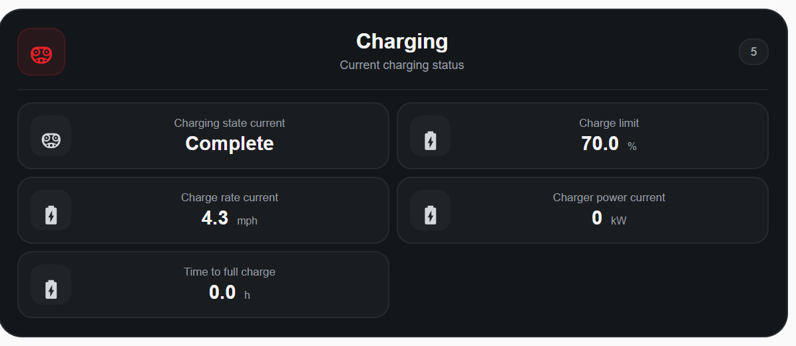

<details>
<summary>Copy YAML</summary>
  
```yaml

type: custom:button-card
grid_options:
  rows: auto
show_name: false
show_icon: false
show_state: false
show_label: false
triggers_update:
  - sensor.car_coaster_charging_state_current
  - sensor.car_coaster_charge_limit
  - sensor.car_coaster_charge_rate_current
  - sensor.car_coaster_charger_power_current
  - sensor.car_coaster_time_to_full_charge
tap_action:
  action: none
hold_action:
  action: none
styles:
  card:
    - width: 100%
    - min-width: 0
    - padding: 12px
    - box-sizing: border-box
    - overflow: hidden
    - border-radius: 16px
    - background: '#14171a'
    - border: 1px solid "#272b2f"
    - box-shadow: none
  grid:
    - grid-template-areas: '"main"'
    - grid-template-columns: minmax(0, 1fr)
    - grid-template-rows: auto
    - width: 100%
  custom_fields:
    main:
      - width: 100%
      - min-width: 0
custom_fields:
  main: |
    [[[
      const ids = ["sensor.car_coaster_charging_state_current", "sensor.car_coaster_charge_limit", "sensor.car_coaster_charge_rate_current", "sensor.car_coaster_charger_power_current", "sensor.car_coaster_time_to_full_charge"];

      const suffix = id => {
        if (id.startsWith('binary_sensor.car_coaster_')) {
          return id.slice('binary_sensor.car_coaster_'.length);
        }
        return id.slice('sensor.car_coaster_'.length);
      };

      const label = id => {
        let name =
          states[id]?.attributes?.friendly_name ||
          suffix(id).replace(/_/g, ' ');

        return name
          .replace(/^Coaster\s*/i, '')
          .replace(/^Car Coaster\s*/i, '')
          .replace(/driVINg/gi, 'driving');
      };

      const iconFor = id => {
        const name = suffix(id);

        if (id.startsWith('binary_sensor.')) return 'mdi:car-tire-alert';
        if (name.includes('ap_fsd')) return 'mdi:steering';
        if (name.includes('tire')) return 'mdi:car-tire-alert';
        if (name.includes('battery_health')) return 'mdi:battery-heart-variant';
        if (name.includes('degradation')) return 'mdi:battery-alert-variant-outline';
        if (name.includes('battery')) return 'mdi:battery';
        if (name.includes('supercharger')) return 'mdi:ev-station';
        if (name.includes('charging')) return 'mdi:ev-plug-tesla';
        if (name.includes('charge')) return 'mdi:battery-charging';
        if (name.includes('cost') || name.includes('invoice')) return 'mdi:currency-usd';
        if (name.includes('energy')) return 'mdi:lightning-bolt';
        if (name.includes('efficiency')) return 'mdi:gauge';
        if (name.includes('speed')) return 'mdi:speedometer';
        if (name.includes('time')) return 'mdi:clock-outline';
        if (name.includes('drives') || name.includes('sessions')) return 'mdi:counter';
        if (name.includes('miles') || name.includes('range') || name.includes('distance')) return 'mdi:road-variant';
        if (name.includes('temperature') || name.includes('_temp_')) return 'mdi:thermometer';
        if (name.includes('sentry')) return 'mdi:shield-car';
        if (name.includes('climate')) return 'mdi:fan';
        if (name.includes('navigation')) return 'mdi:navigation-variant';
        if (name.includes('location') || name.includes('destination') || name.endsWith('_start')) return 'mdi:map-marker';
        if (name.includes('software')) return 'mdi:update';
        if (name.includes('firmware') || name.includes('alert')) return 'mdi:alert-outline';
        if (name.includes('odometer')) return 'mdi:counter';
        if (name.includes('connection')) return 'mdi:signal';
        if (name.includes('wake')) return 'mdi:weather-sunset-up';
        if (name.includes('vehicle_status')) return 'mdi:car-connected';
        return 'mdi:information-outline';
      };

      const format = id => {
        const entity = states[id];

        if (!entity) {
          return { value: '—', unit: '', cls: 'muted' };
        }

        const raw = String(entity.state ?? '').trim();

        if (!raw || raw === 'unknown' || raw === 'unavailable') {
          return { value: '—', unit: '', cls: 'muted' };
        }

        if (id.startsWith('binary_sensor.')) {
          if (raw === 'on') return { value: 'LOW', unit: '', cls: 'danger' };
          if (raw === 'off') return { value: 'NORMAL', unit: '', cls: 'good' };
        }

        const unit = entity.attributes?.unit_of_measurement || '';
        const deviceClass = entity.attributes?.device_class || '';
        const number = Number(raw);

        if (
          deviceClass === 'timestamp' ||
          (raw.includes('T') && !Number.isFinite(number))
        ) {
          const date = new Date(raw);
          if (!Number.isNaN(date.getTime())) {
            return {
              value: date.toLocaleString(undefined, {
                month: 'short',
                day: 'numeric',
                hour: 'numeric',
                minute: '2-digit'
              }),
              unit: '',
              cls: ''
            };
          }
        }

        if (Number.isFinite(number)) {
          if (unit === 'USD' || unit === '$') {
            return {
              value: `$${number.toLocaleString(undefined, {
                minimumFractionDigits: 2,
                maximumFractionDigits: 2
              })}`,
              unit: '',
              cls: ''
            };
          }

          if (unit === 'min') {
            const absolute = Math.abs(number);
            if (absolute >= 1440) {
              const days = Math.floor(absolute / 1440);
              const hours = Math.floor((absolute % 1440) / 60);
              return {
                value: `${number < 0 ? '-' : ''}${days}d ${hours}h`,
                unit: '',
                cls: ''
              };
            }
            if (absolute >= 60) {
              const hours = Math.floor(absolute / 60);
              const minutes = Math.round(absolute % 60);
              return {
                value: `${number < 0 ? '-' : ''}${hours}h ${minutes}m`,
                unit: '',
                cls: ''
              };
            }
          }

          let decimals = 1;
          if (unit === 'kWh' || unit === 'mi') decimals = 2;
          if (unit === 'Wh/mi' || unit === 'kW') decimals = 0;
          if (!unit) decimals = Number.isInteger(number) ? 0 : 1;

          return {
            value: number.toLocaleString(undefined, {
              minimumFractionDigits: decimals,
              maximumFractionDigits: decimals
            }),
            unit,
            cls: number < 0 ? 'danger' : ''
          };
        }

        return { value: raw, unit: '', cls: '' };
      };

      const metrics = ids.map(id => {
        const data = format(id);

        return `
          <div class="metric">
            <div class="metric-icon">
              <ha-icon icon="${iconFor(id)}"></ha-icon>
            </div>
            <div class="metric-copy">
              <div class="metric-label">${label(id)}</div>
              <div class="metric-value ${data.cls}">
                ${data.value}
                ${data.unit ? `<span class="unit">${data.unit}</span>` : ''}
              </div>
            </div>
          </div>
        `;
      }).join('');

      return `
        <style>
          .card {
            --text: #f4f4f4;
            --secondary: #969ba1;
            --muted: #666c72;
            --red: #e82127;
            --good: #4cd964;
            --danger: #ff514b;
            width: 100%;
            min-width: 0;
            color: var(--text);
            font-family: Arial, Helvetica, sans-serif;
          }

          .header {
            display: grid;
            grid-template-columns: 32px minmax(0,1fr) auto;
            gap: 9px;
            align-items: center;
            padding-bottom: 9px;
            margin-bottom: 8px;
            border-bottom: 1px solid rgba(255,255,255,.06);
          }

          .header-icon {
            width: 30px;
            height: 30px;
            display: flex;
            align-items: center;
            justify-content: center;
            border-radius: 9px;
            background: rgba(232,33,39,.09);
            border: 1px solid rgba(232,33,39,.15);
          }

          .header-icon ha-icon {
            width: 17px;
            height: 17px;
            color: var(--red);
          }

          .title {
            overflow: hidden;
            text-overflow: ellipsis;
            white-space: nowrap;
            font-size: 14px;
            line-height: 1;
            font-weight: 650;
          }

          .subtitle {
            margin-top: 4px;
            overflow: hidden;
            text-overflow: ellipsis;
            white-space: nowrap;
            font-size: 8px;
            color: var(--secondary);
          }

          .count {
            min-width: 20px;
            height: 18px;
            padding: 0 6px;
            display: flex;
            align-items: center;
            justify-content: center;
            box-sizing: border-box;
            border-radius: 8px;
            background: #1d2023;
            border: 1px solid #272b2f;
            font-size: 8px;
            color: var(--secondary);
          }

          .metrics {
            display: grid;
            grid-template-columns: repeat(2, minmax(0,1fr));
            gap: 5px;
          }

          .metric {
            min-width: 0;
            display: grid;
            grid-template-columns: 28px minmax(0,1fr);
            gap: 7px;
            align-items: center;
            padding: 8px;
            box-sizing: border-box;
            border-radius: 10px;
            background: #1a1d20;
            border: 1px solid rgba(255,255,255,.06);
          }

          .metric-icon {
            width: 27px;
            height: 27px;
            display: flex;
            align-items: center;
            justify-content: center;
            border-radius: 8px;
            background: #202428;
          }

          .metric-icon ha-icon {
            width: 15px;
            height: 15px;
            color: #d5d7da;
          }

          .metric-copy {
            min-width: 0;
          }

          .metric-label {
            margin-bottom: 3px;
            overflow: hidden;
            text-overflow: ellipsis;
            white-space: nowrap;
            font-size: 7.5px;
            color: var(--secondary);
          }

          .metric-value {
            overflow: hidden;
            text-overflow: ellipsis;
            white-space: nowrap;
            font-size: 13px;
            line-height: 1;
            font-weight: 650;
          }

          .unit {
            margin-left: 2px;
            font-size: 7px;
            font-weight: 500;
            color: var(--secondary);
          }

          .muted { color: var(--muted); }
          .good { color: var(--good); }
          .danger { color: var(--danger); }

          @media (max-width: 700px) {
            .metrics {
              grid-template-columns: repeat(2, minmax(0,1fr));
            }
          }
        </style>

        <div class="card">
          <div class="header">
            <div class="header-icon">
              <ha-icon icon="mdi:ev-plug-tesla"></ha-icon>
            </div>
            <div>
              <div class="title">Charging</div>
              <div class="subtitle">Current charging status</div>
            </div>
            <div class="count">${ids.length}</div>
          </div>
          <div class="metrics">
            ${metrics}
          </div>
        </div>
      `;
    ]]]


```

</details>

---

## Driving — Today

Today's drive count, miles, energy, drive time, efficiency, battery use, AP/FSD miles, speeds, and longest drive.

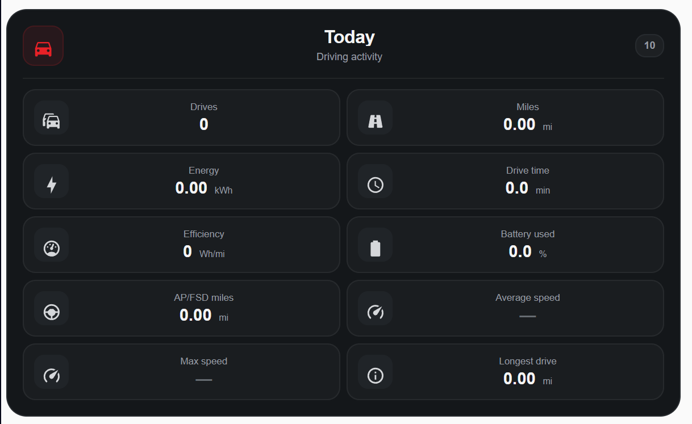

<details>
<summary>Copy YAML</summary>
  
```yaml

type: custom:button-card
grid_options:
  rows: auto
show_name: false
show_icon: false
show_state: false
show_label: false
triggers_update:
  - sensor.car_coaster_drives_today
  - sensor.car_coaster_miles_today
  - sensor.car_coaster_energy_today
  - sensor.car_coaster_drive_time_today
  - sensor.car_coaster_efficiency_today
  - sensor.car_coaster_battery_used_today
  - sensor.car_coaster_ap_fsd_miles_today
  - sensor.car_coaster_average_speed_today
  - sensor.car_coaster_max_speed_today
  - sensor.car_coaster_longest_drive_today
tap_action:
  action: none
hold_action:
  action: none
styles:
  card:
    - width: 100%
    - min-width: 0
    - padding: 12px
    - box-sizing: border-box
    - overflow: hidden
    - border-radius: 16px
    - background: '#14171a'
    - border: 1px solid "#272b2f"
    - box-shadow: none
  grid:
    - grid-template-areas: '"main"'
    - grid-template-columns: minmax(0, 1fr)
    - grid-template-rows: auto
    - width: 100%
  custom_fields:
    main:
      - width: 100%
      - min-width: 0
custom_fields:
  main: |
    [[[
      const ids = ["sensor.car_coaster_drives_today", "sensor.car_coaster_miles_today", "sensor.car_coaster_energy_today", "sensor.car_coaster_drive_time_today", "sensor.car_coaster_efficiency_today", "sensor.car_coaster_battery_used_today", "sensor.car_coaster_ap_fsd_miles_today", "sensor.car_coaster_average_speed_today", "sensor.car_coaster_max_speed_today", "sensor.car_coaster_longest_drive_today"];

      const suffix = id => {
        if (id.startsWith('binary_sensor.car_coaster_')) {
          return id.slice('binary_sensor.car_coaster_'.length);
        }
        return id.slice('sensor.car_coaster_'.length);
      };

      const label = id => {
        let name =
          states[id]?.attributes?.friendly_name ||
          suffix(id).replace(/_/g, ' ');

        return name
          .replace(/^Coaster\s*/i, '')
          .replace(/^Car Coaster\s*/i, '')
          .replace(/driVINg/gi, 'driving');
      };

      const iconFor = id => {
        const name = suffix(id);

        if (id.startsWith('binary_sensor.')) return 'mdi:car-tire-alert';
        if (name.includes('ap_fsd')) return 'mdi:steering';
        if (name.includes('tire')) return 'mdi:car-tire-alert';
        if (name.includes('battery_health')) return 'mdi:battery-heart-variant';
        if (name.includes('degradation')) return 'mdi:battery-alert-variant-outline';
        if (name.includes('battery')) return 'mdi:battery';
        if (name.includes('supercharger')) return 'mdi:ev-station';
        if (name.includes('charging')) return 'mdi:ev-plug-tesla';
        if (name.includes('charge')) return 'mdi:battery-charging';
        if (name.includes('cost') || name.includes('invoice')) return 'mdi:currency-usd';
        if (name.includes('energy')) return 'mdi:lightning-bolt';
        if (name.includes('efficiency')) return 'mdi:gauge';
        if (name.includes('speed')) return 'mdi:speedometer';
        if (name.includes('time')) return 'mdi:clock-outline';
        if (name.includes('drives') || name.includes('sessions')) return 'mdi:counter';
        if (name.includes('miles') || name.includes('range') || name.includes('distance')) return 'mdi:road-variant';
        if (name.includes('temperature') || name.includes('_temp_')) return 'mdi:thermometer';
        if (name.includes('sentry')) return 'mdi:shield-car';
        if (name.includes('climate')) return 'mdi:fan';
        if (name.includes('navigation')) return 'mdi:navigation-variant';
        if (name.includes('location') || name.includes('destination') || name.endsWith('_start')) return 'mdi:map-marker';
        if (name.includes('software')) return 'mdi:update';
        if (name.includes('firmware') || name.includes('alert')) return 'mdi:alert-outline';
        if (name.includes('odometer')) return 'mdi:counter';
        if (name.includes('connection')) return 'mdi:signal';
        if (name.includes('wake')) return 'mdi:weather-sunset-up';
        if (name.includes('vehicle_status')) return 'mdi:car-connected';
        return 'mdi:information-outline';
      };

      const format = id => {
        const entity = states[id];

        if (!entity) {
          return { value: '—', unit: '', cls: 'muted' };
        }

        const raw = String(entity.state ?? '').trim();

        if (!raw || raw === 'unknown' || raw === 'unavailable') {
          return { value: '—', unit: '', cls: 'muted' };
        }

        if (id.startsWith('binary_sensor.')) {
          if (raw === 'on') return { value: 'LOW', unit: '', cls: 'danger' };
          if (raw === 'off') return { value: 'NORMAL', unit: '', cls: 'good' };
        }

        const unit = entity.attributes?.unit_of_measurement || '';
        const deviceClass = entity.attributes?.device_class || '';
        const number = Number(raw);

        if (
          deviceClass === 'timestamp' ||
          (raw.includes('T') && !Number.isFinite(number))
        ) {
          const date = new Date(raw);
          if (!Number.isNaN(date.getTime())) {
            return {
              value: date.toLocaleString(undefined, {
                month: 'short',
                day: 'numeric',
                hour: 'numeric',
                minute: '2-digit'
              }),
              unit: '',
              cls: ''
            };
          }
        }

        if (Number.isFinite(number)) {
          if (unit === 'USD' || unit === '$') {
            return {
              value: `$${number.toLocaleString(undefined, {
                minimumFractionDigits: 2,
                maximumFractionDigits: 2
              })}`,
              unit: '',
              cls: ''
            };
          }

          if (unit === 'min') {
            const absolute = Math.abs(number);
            if (absolute >= 1440) {
              const days = Math.floor(absolute / 1440);
              const hours = Math.floor((absolute % 1440) / 60);
              return {
                value: `${number < 0 ? '-' : ''}${days}d ${hours}h`,
                unit: '',
                cls: ''
              };
            }
            if (absolute >= 60) {
              const hours = Math.floor(absolute / 60);
              const minutes = Math.round(absolute % 60);
              return {
                value: `${number < 0 ? '-' : ''}${hours}h ${minutes}m`,
                unit: '',
                cls: ''
              };
            }
          }

          let decimals = 1;
          if (unit === 'kWh' || unit === 'mi') decimals = 2;
          if (unit === 'Wh/mi' || unit === 'kW') decimals = 0;
          if (!unit) decimals = Number.isInteger(number) ? 0 : 1;

          return {
            value: number.toLocaleString(undefined, {
              minimumFractionDigits: decimals,
              maximumFractionDigits: decimals
            }),
            unit,
            cls: number < 0 ? 'danger' : ''
          };
        }

        return { value: raw, unit: '', cls: '' };
      };

      const metrics = ids.map(id => {
        const data = format(id);

        return `
          <div class="metric">
            <div class="metric-icon">
              <ha-icon icon="${iconFor(id)}"></ha-icon>
            </div>
            <div class="metric-copy">
              <div class="metric-label">${label(id)}</div>
              <div class="metric-value ${data.cls}">
                ${data.value}
                ${data.unit ? `<span class="unit">${data.unit}</span>` : ''}
              </div>
            </div>
          </div>
        `;
      }).join('');

      return `
        <style>
          .card {
            --text: #f4f4f4;
            --secondary: #969ba1;
            --muted: #666c72;
            --red: #e82127;
            --good: #4cd964;
            --danger: #ff514b;
            width: 100%;
            min-width: 0;
            color: var(--text);
            font-family: Arial, Helvetica, sans-serif;
          }

          .header {
            display: grid;
            grid-template-columns: 32px minmax(0,1fr) auto;
            gap: 9px;
            align-items: center;
            padding-bottom: 9px;
            margin-bottom: 8px;
            border-bottom: 1px solid rgba(255,255,255,.06);
          }

          .header-icon {
            width: 30px;
            height: 30px;
            display: flex;
            align-items: center;
            justify-content: center;
            border-radius: 9px;
            background: rgba(232,33,39,.09);
            border: 1px solid rgba(232,33,39,.15);
          }

          .header-icon ha-icon {
            width: 17px;
            height: 17px;
            color: var(--red);
          }

          .title {
            overflow: hidden;
            text-overflow: ellipsis;
            white-space: nowrap;
            font-size: 14px;
            line-height: 1;
            font-weight: 650;
          }

          .subtitle {
            margin-top: 4px;
            overflow: hidden;
            text-overflow: ellipsis;
            white-space: nowrap;
            font-size: 8px;
            color: var(--secondary);
          }

          .count {
            min-width: 20px;
            height: 18px;
            padding: 0 6px;
            display: flex;
            align-items: center;
            justify-content: center;
            box-sizing: border-box;
            border-radius: 8px;
            background: #1d2023;
            border: 1px solid #272b2f;
            font-size: 8px;
            color: var(--secondary);
          }

          .metrics {
            display: grid;
            grid-template-columns: repeat(2, minmax(0,1fr));
            gap: 5px;
          }

          .metric {
            min-width: 0;
            display: grid;
            grid-template-columns: 28px minmax(0,1fr);
            gap: 7px;
            align-items: center;
            padding: 8px;
            box-sizing: border-box;
            border-radius: 10px;
            background: #1a1d20;
            border: 1px solid rgba(255,255,255,.06);
          }

          .metric-icon {
            width: 27px;
            height: 27px;
            display: flex;
            align-items: center;
            justify-content: center;
            border-radius: 8px;
            background: #202428;
          }

          .metric-icon ha-icon {
            width: 15px;
            height: 15px;
            color: #d5d7da;
          }

          .metric-copy {
            min-width: 0;
          }

          .metric-label {
            margin-bottom: 3px;
            overflow: hidden;
            text-overflow: ellipsis;
            white-space: nowrap;
            font-size: 7.5px;
            color: var(--secondary);
          }

          .metric-value {
            overflow: hidden;
            text-overflow: ellipsis;
            white-space: nowrap;
            font-size: 13px;
            line-height: 1;
            font-weight: 650;
          }

          .unit {
            margin-left: 2px;
            font-size: 7px;
            font-weight: 500;
            color: var(--secondary);
          }

          .muted { color: var(--muted); }
          .good { color: var(--good); }
          .danger { color: var(--danger); }

          @media (max-width: 700px) {
            .metrics {
              grid-template-columns: repeat(2, minmax(0,1fr));
            }
          }
        </style>

        <div class="card">
          <div class="header">
            <div class="header-icon">
              <ha-icon icon="mdi:car"></ha-icon>
            </div>
            <div>
              <div class="title">Today</div>
              <div class="subtitle">Driving activity</div>
            </div>
            <div class="count">${ids.length}</div>
          </div>
          <div class="metrics">
            ${metrics}
          </div>
        </div>
      `;
    ]]]


```

</details>

---

## Driving — This Week

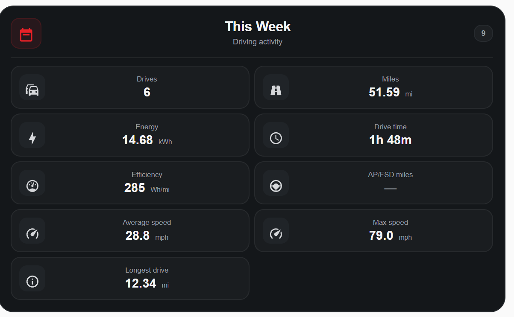

<details>
<summary>Copy YAML</summary>
  
```yaml

type: custom:button-card
grid_options:
  rows: auto
show_name: false
show_icon: false
show_state: false
show_label: false
triggers_update:
  - sensor.car_coaster_drives_this_week
  - sensor.car_coaster_miles_this_week
  - sensor.car_coaster_energy_this_week
  - sensor.car_coaster_drive_time_this_week
  - sensor.car_coaster_efficiency_this_week
  - sensor.car_coaster_battery_used_this_week
  - sensor.car_coaster_ap_fsd_miles_this_week
  - sensor.car_coaster_average_speed_this_week
  - sensor.car_coaster_max_speed_this_week
  - sensor.car_coaster_longest_drive_this_week
tap_action:
  action: none
hold_action:
  action: none
styles:
  card:
    - width: 100%
    - min-width: 0
    - padding: 12px
    - box-sizing: border-box
    - overflow: hidden
    - border-radius: 16px
    - background: '#14171a'
    - border: 1px solid "#272b2f"
    - box-shadow: none
  grid:
    - grid-template-areas: '"main"'
    - grid-template-columns: minmax(0, 1fr)
    - grid-template-rows: auto
    - width: 100%
  custom_fields:
    main:
      - width: 100%
      - min-width: 0
custom_fields:
  main: |
    [[[
      const ids = ["sensor.car_coaster_drives_this_week", "sensor.car_coaster_miles_this_week", "sensor.car_coaster_energy_this_week", "sensor.car_coaster_drive_time_this_week", "sensor.car_coaster_efficiency_this_week", "sensor.car_coaster_battery_used_this_week", "sensor.car_coaster_ap_fsd_miles_this_week", "sensor.car_coaster_average_speed_this_week", "sensor.car_coaster_max_speed_this_week", "sensor.car_coaster_longest_drive_this_week"];

      const suffix = id => {
        if (id.startsWith('binary_sensor.car_coaster_')) {
          return id.slice('binary_sensor.car_coaster_'.length);
        }
        return id.slice('sensor.car_coaster_'.length);
      };

      const label = id => {
        let name =
          states[id]?.attributes?.friendly_name ||
          suffix(id).replace(/_/g, ' ');

        return name
          .replace(/^Coaster\s*/i, '')
          .replace(/^Car Coaster\s*/i, '')
          .replace(/driVINg/gi, 'driving');
      };

      const iconFor = id => {
        const name = suffix(id);

        if (id.startsWith('binary_sensor.')) return 'mdi:car-tire-alert';
        if (name.includes('ap_fsd')) return 'mdi:steering';
        if (name.includes('tire')) return 'mdi:car-tire-alert';
        if (name.includes('battery_health')) return 'mdi:battery-heart-variant';
        if (name.includes('degradation')) return 'mdi:battery-alert-variant-outline';
        if (name.includes('battery')) return 'mdi:battery';
        if (name.includes('supercharger')) return 'mdi:ev-station';
        if (name.includes('charging')) return 'mdi:ev-plug-tesla';
        if (name.includes('charge')) return 'mdi:battery-charging';
        if (name.includes('cost') || name.includes('invoice')) return 'mdi:currency-usd';
        if (name.includes('energy')) return 'mdi:lightning-bolt';
        if (name.includes('efficiency')) return 'mdi:gauge';
        if (name.includes('speed')) return 'mdi:speedometer';
        if (name.includes('time')) return 'mdi:clock-outline';
        if (name.includes('drives') || name.includes('sessions')) return 'mdi:counter';
        if (name.includes('miles') || name.includes('range') || name.includes('distance')) return 'mdi:road-variant';
        if (name.includes('temperature') || name.includes('_temp_')) return 'mdi:thermometer';
        if (name.includes('sentry')) return 'mdi:shield-car';
        if (name.includes('climate')) return 'mdi:fan';
        if (name.includes('navigation')) return 'mdi:navigation-variant';
        if (name.includes('location') || name.includes('destination') || name.endsWith('_start')) return 'mdi:map-marker';
        if (name.includes('software')) return 'mdi:update';
        if (name.includes('firmware') || name.includes('alert')) return 'mdi:alert-outline';
        if (name.includes('odometer')) return 'mdi:counter';
        if (name.includes('connection')) return 'mdi:signal';
        if (name.includes('wake')) return 'mdi:weather-sunset-up';
        if (name.includes('vehicle_status')) return 'mdi:car-connected';
        return 'mdi:information-outline';
      };

      const format = id => {
        const entity = states[id];

        if (!entity) {
          return { value: '—', unit: '', cls: 'muted' };
        }

        const raw = String(entity.state ?? '').trim();

        if (!raw || raw === 'unknown' || raw === 'unavailable') {
          return { value: '—', unit: '', cls: 'muted' };
        }

        if (id.startsWith('binary_sensor.')) {
          if (raw === 'on') return { value: 'LOW', unit: '', cls: 'danger' };
          if (raw === 'off') return { value: 'NORMAL', unit: '', cls: 'good' };
        }

        const unit = entity.attributes?.unit_of_measurement || '';
        const deviceClass = entity.attributes?.device_class || '';
        const number = Number(raw);

        if (
          deviceClass === 'timestamp' ||
          (raw.includes('T') && !Number.isFinite(number))
        ) {
          const date = new Date(raw);
          if (!Number.isNaN(date.getTime())) {
            return {
              value: date.toLocaleString(undefined, {
                month: 'short',
                day: 'numeric',
                hour: 'numeric',
                minute: '2-digit'
              }),
              unit: '',
              cls: ''
            };
          }
        }

        if (Number.isFinite(number)) {
          if (unit === 'USD' || unit === '$') {
            return {
              value: `$${number.toLocaleString(undefined, {
                minimumFractionDigits: 2,
                maximumFractionDigits: 2
              })}`,
              unit: '',
              cls: ''
            };
          }

          if (unit === 'min') {
            const absolute = Math.abs(number);
            if (absolute >= 1440) {
              const days = Math.floor(absolute / 1440);
              const hours = Math.floor((absolute % 1440) / 60);
              return {
                value: `${number < 0 ? '-' : ''}${days}d ${hours}h`,
                unit: '',
                cls: ''
              };
            }
            if (absolute >= 60) {
              const hours = Math.floor(absolute / 60);
              const minutes = Math.round(absolute % 60);
              return {
                value: `${number < 0 ? '-' : ''}${hours}h ${minutes}m`,
                unit: '',
                cls: ''
              };
            }
          }

          let decimals = 1;
          if (unit === 'kWh' || unit === 'mi') decimals = 2;
          if (unit === 'Wh/mi' || unit === 'kW') decimals = 0;
          if (!unit) decimals = Number.isInteger(number) ? 0 : 1;

          return {
            value: number.toLocaleString(undefined, {
              minimumFractionDigits: decimals,
              maximumFractionDigits: decimals
            }),
            unit,
            cls: number < 0 ? 'danger' : ''
          };
        }

        return { value: raw, unit: '', cls: '' };
      };

      const metrics = ids.map(id => {
        const data = format(id);

        return `
          <div class="metric">
            <div class="metric-icon">
              <ha-icon icon="${iconFor(id)}"></ha-icon>
            </div>
            <div class="metric-copy">
              <div class="metric-label">${label(id)}</div>
              <div class="metric-value ${data.cls}">
                ${data.value}
                ${data.unit ? `<span class="unit">${data.unit}</span>` : ''}
              </div>
            </div>
          </div>
        `;
      }).join('');

      return `
        <style>
          .card {
            --text: #f4f4f4;
            --secondary: #969ba1;
            --muted: #666c72;
            --red: #e82127;
            --good: #4cd964;
            --danger: #ff514b;
            width: 100%;
            min-width: 0;
            color: var(--text);
            font-family: Arial, Helvetica, sans-serif;
          }

          .header {
            display: grid;
            grid-template-columns: 32px minmax(0,1fr) auto;
            gap: 9px;
            align-items: center;
            padding-bottom: 9px;
            margin-bottom: 8px;
            border-bottom: 1px solid rgba(255,255,255,.06);
          }

          .header-icon {
            width: 30px;
            height: 30px;
            display: flex;
            align-items: center;
            justify-content: center;
            border-radius: 9px;
            background: rgba(232,33,39,.09);
            border: 1px solid rgba(232,33,39,.15);
          }

          .header-icon ha-icon {
            width: 17px;
            height: 17px;
            color: var(--red);
          }

          .title {
            overflow: hidden;
            text-overflow: ellipsis;
            white-space: nowrap;
            font-size: 14px;
            line-height: 1;
            font-weight: 650;
          }

          .subtitle {
            margin-top: 4px;
            overflow: hidden;
            text-overflow: ellipsis;
            white-space: nowrap;
            font-size: 8px;
            color: var(--secondary);
          }

          .count {
            min-width: 20px;
            height: 18px;
            padding: 0 6px;
            display: flex;
            align-items: center;
            justify-content: center;
            box-sizing: border-box;
            border-radius: 8px;
            background: #1d2023;
            border: 1px solid #272b2f;
            font-size: 8px;
            color: var(--secondary);
          }

          .metrics {
            display: grid;
            grid-template-columns: repeat(2, minmax(0,1fr));
            gap: 5px;
          }

          .metric {
            min-width: 0;
            display: grid;
            grid-template-columns: 28px minmax(0,1fr);
            gap: 7px;
            align-items: center;
            padding: 8px;
            box-sizing: border-box;
            border-radius: 10px;
            background: #1a1d20;
            border: 1px solid rgba(255,255,255,.06);
          }

          .metric-icon {
            width: 27px;
            height: 27px;
            display: flex;
            align-items: center;
            justify-content: center;
            border-radius: 8px;
            background: #202428;
          }

          .metric-icon ha-icon {
            width: 15px;
            height: 15px;
            color: #d5d7da;
          }

          .metric-copy {
            min-width: 0;
          }

          .metric-label {
            margin-bottom: 3px;
            overflow: hidden;
            text-overflow: ellipsis;
            white-space: nowrap;
            font-size: 7.5px;
            color: var(--secondary);
          }

          .metric-value {
            overflow: hidden;
            text-overflow: ellipsis;
            white-space: nowrap;
            font-size: 13px;
            line-height: 1;
            font-weight: 650;
          }

          .unit {
            margin-left: 2px;
            font-size: 7px;
            font-weight: 500;
            color: var(--secondary);
          }

          .muted { color: var(--muted); }
          .good { color: var(--good); }
          .danger { color: var(--danger); }

          @media (max-width: 700px) {
            .metrics {
              grid-template-columns: repeat(2, minmax(0,1fr));
            }
          }
        </style>

        <div class="card">
          <div class="header">
            <div class="header-icon">
              <ha-icon icon="mdi:calendar-week"></ha-icon>
            </div>
            <div>
              <div class="title">This Week</div>
              <div class="subtitle">Driving activity</div>
            </div>
            <div class="count">${ids.length}</div>
          </div>
          <div class="metrics">
            ${metrics}
          </div>
        </div>
      `;
    ]]]


```

</details>

---

## Driving — This Month

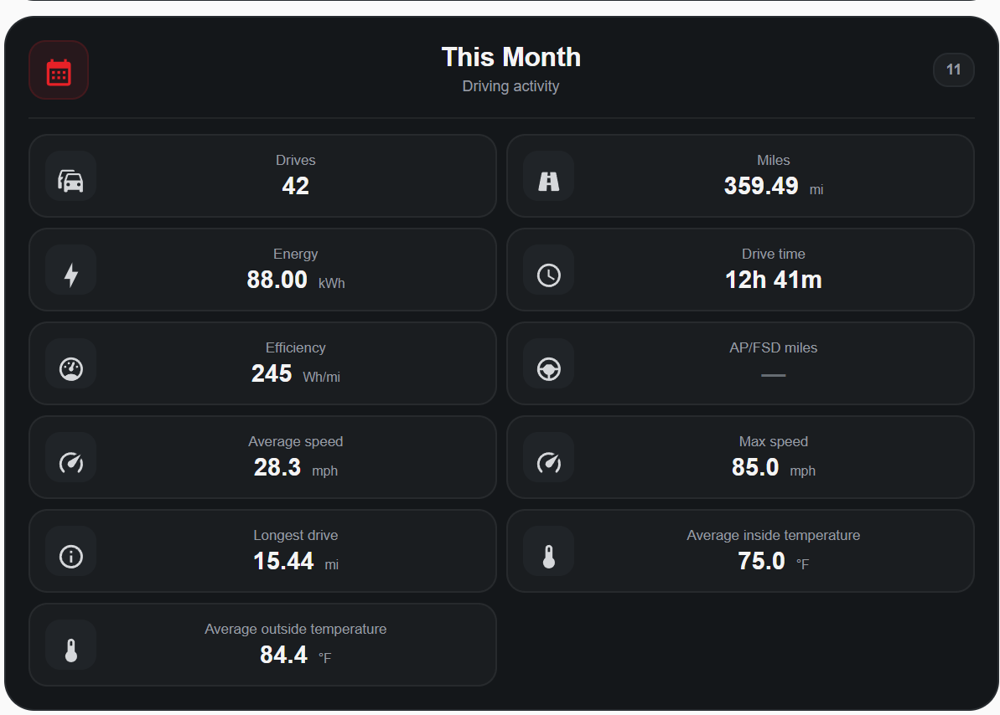

<details>
<summary>Copy YAML</summary>
  
```yaml

type: custom:button-card
grid_options:
  rows: auto
show_name: false
show_icon: false
show_state: false
show_label: false
triggers_update:
  - sensor.car_coaster_drives_this_month
  - sensor.car_coaster_miles_this_month
  - sensor.car_coaster_energy_this_month
  - sensor.car_coaster_drive_time_this_month
  - sensor.car_coaster_efficiency_this_month
  - sensor.car_coaster_battery_used_this_month
  - sensor.car_coaster_ap_fsd_miles_this_month
  - sensor.car_coaster_average_speed_this_month
  - sensor.car_coaster_max_speed_this_month
  - sensor.car_coaster_longest_drive_this_month
  - sensor.car_coaster_average_inside_temperature_this_month
  - sensor.car_coaster_average_outside_temperature_this_month
tap_action:
  action: none
hold_action:
  action: none
styles:
  card:
    - width: 100%
    - min-width: 0
    - padding: 12px
    - box-sizing: border-box
    - overflow: hidden
    - border-radius: 16px
    - background: '#14171a'
    - border: 1px solid "#272b2f"
    - box-shadow: none
  grid:
    - grid-template-areas: '"main"'
    - grid-template-columns: minmax(0, 1fr)
    - grid-template-rows: auto
    - width: 100%
  custom_fields:
    main:
      - width: 100%
      - min-width: 0
custom_fields:
  main: |
    [[[
      const ids = ["sensor.car_coaster_drives_this_month", "sensor.car_coaster_miles_this_month", "sensor.car_coaster_energy_this_month", "sensor.car_coaster_drive_time_this_month", "sensor.car_coaster_efficiency_this_month", "sensor.car_coaster_battery_used_this_month", "sensor.car_coaster_ap_fsd_miles_this_month", "sensor.car_coaster_average_speed_this_month", "sensor.car_coaster_max_speed_this_month", "sensor.car_coaster_longest_drive_this_month", "sensor.car_coaster_average_inside_temperature_this_month", "sensor.car_coaster_average_outside_temperature_this_month"];

      const suffix = id => {
        if (id.startsWith('binary_sensor.car_coaster_')) {
          return id.slice('binary_sensor.car_coaster_'.length);
        }
        return id.slice('sensor.car_coaster_'.length);
      };

      const label = id => {
        let name =
          states[id]?.attributes?.friendly_name ||
          suffix(id).replace(/_/g, ' ');

        return name
          .replace(/^Coaster\s*/i, '')
          .replace(/^Car Coaster\s*/i, '')
          .replace(/driVINg/gi, 'driving');
      };

      const iconFor = id => {
        const name = suffix(id);

        if (id.startsWith('binary_sensor.')) return 'mdi:car-tire-alert';
        if (name.includes('ap_fsd')) return 'mdi:steering';
        if (name.includes('tire')) return 'mdi:car-tire-alert';
        if (name.includes('battery_health')) return 'mdi:battery-heart-variant';
        if (name.includes('degradation')) return 'mdi:battery-alert-variant-outline';
        if (name.includes('battery')) return 'mdi:battery';
        if (name.includes('supercharger')) return 'mdi:ev-station';
        if (name.includes('charging')) return 'mdi:ev-plug-tesla';
        if (name.includes('charge')) return 'mdi:battery-charging';
        if (name.includes('cost') || name.includes('invoice')) return 'mdi:currency-usd';
        if (name.includes('energy')) return 'mdi:lightning-bolt';
        if (name.includes('efficiency')) return 'mdi:gauge';
        if (name.includes('speed')) return 'mdi:speedometer';
        if (name.includes('time')) return 'mdi:clock-outline';
        if (name.includes('drives') || name.includes('sessions')) return 'mdi:counter';
        if (name.includes('miles') || name.includes('range') || name.includes('distance')) return 'mdi:road-variant';
        if (name.includes('temperature') || name.includes('_temp_')) return 'mdi:thermometer';
        if (name.includes('sentry')) return 'mdi:shield-car';
        if (name.includes('climate')) return 'mdi:fan';
        if (name.includes('navigation')) return 'mdi:navigation-variant';
        if (name.includes('location') || name.includes('destination') || name.endsWith('_start')) return 'mdi:map-marker';
        if (name.includes('software')) return 'mdi:update';
        if (name.includes('firmware') || name.includes('alert')) return 'mdi:alert-outline';
        if (name.includes('odometer')) return 'mdi:counter';
        if (name.includes('connection')) return 'mdi:signal';
        if (name.includes('wake')) return 'mdi:weather-sunset-up';
        if (name.includes('vehicle_status')) return 'mdi:car-connected';
        return 'mdi:information-outline';
      };

      const format = id => {
        const entity = states[id];

        if (!entity) {
          return { value: '—', unit: '', cls: 'muted' };
        }

        const raw = String(entity.state ?? '').trim();

        if (!raw || raw === 'unknown' || raw === 'unavailable') {
          return { value: '—', unit: '', cls: 'muted' };
        }

        if (id.startsWith('binary_sensor.')) {
          if (raw === 'on') return { value: 'LOW', unit: '', cls: 'danger' };
          if (raw === 'off') return { value: 'NORMAL', unit: '', cls: 'good' };
        }

        const unit = entity.attributes?.unit_of_measurement || '';
        const deviceClass = entity.attributes?.device_class || '';
        const number = Number(raw);

        if (
          deviceClass === 'timestamp' ||
          (raw.includes('T') && !Number.isFinite(number))
        ) {
          const date = new Date(raw);
          if (!Number.isNaN(date.getTime())) {
            return {
              value: date.toLocaleString(undefined, {
                month: 'short',
                day: 'numeric',
                hour: 'numeric',
                minute: '2-digit'
              }),
              unit: '',
              cls: ''
            };
          }
        }

        if (Number.isFinite(number)) {
          if (unit === 'USD' || unit === '$') {
            return {
              value: `$${number.toLocaleString(undefined, {
                minimumFractionDigits: 2,
                maximumFractionDigits: 2
              })}`,
              unit: '',
              cls: ''
            };
          }

          if (unit === 'min') {
            const absolute = Math.abs(number);
            if (absolute >= 1440) {
              const days = Math.floor(absolute / 1440);
              const hours = Math.floor((absolute % 1440) / 60);
              return {
                value: `${number < 0 ? '-' : ''}${days}d ${hours}h`,
                unit: '',
                cls: ''
              };
            }
            if (absolute >= 60) {
              const hours = Math.floor(absolute / 60);
              const minutes = Math.round(absolute % 60);
              return {
                value: `${number < 0 ? '-' : ''}${hours}h ${minutes}m`,
                unit: '',
                cls: ''
              };
            }
          }

          let decimals = 1;
          if (unit === 'kWh' || unit === 'mi') decimals = 2;
          if (unit === 'Wh/mi' || unit === 'kW') decimals = 0;
          if (!unit) decimals = Number.isInteger(number) ? 0 : 1;

          return {
            value: number.toLocaleString(undefined, {
              minimumFractionDigits: decimals,
              maximumFractionDigits: decimals
            }),
            unit,
            cls: number < 0 ? 'danger' : ''
          };
        }

        return { value: raw, unit: '', cls: '' };
      };

      const metrics = ids.map(id => {
        const data = format(id);

        return `
          <div class="metric">
            <div class="metric-icon">
              <ha-icon icon="${iconFor(id)}"></ha-icon>
            </div>
            <div class="metric-copy">
              <div class="metric-label">${label(id)}</div>
              <div class="metric-value ${data.cls}">
                ${data.value}
                ${data.unit ? `<span class="unit">${data.unit}</span>` : ''}
              </div>
            </div>
          </div>
        `;
      }).join('');

      return `
        <style>
          .card {
            --text: #f4f4f4;
            --secondary: #969ba1;
            --muted: #666c72;
            --red: #e82127;
            --good: #4cd964;
            --danger: #ff514b;
            width: 100%;
            min-width: 0;
            color: var(--text);
            font-family: Arial, Helvetica, sans-serif;
          }

          .header {
            display: grid;
            grid-template-columns: 32px minmax(0,1fr) auto;
            gap: 9px;
            align-items: center;
            padding-bottom: 9px;
            margin-bottom: 8px;
            border-bottom: 1px solid rgba(255,255,255,.06);
          }

          .header-icon {
            width: 30px;
            height: 30px;
            display: flex;
            align-items: center;
            justify-content: center;
            border-radius: 9px;
            background: rgba(232,33,39,.09);
            border: 1px solid rgba(232,33,39,.15);
          }

          .header-icon ha-icon {
            width: 17px;
            height: 17px;
            color: var(--red);
          }

          .title {
            overflow: hidden;
            text-overflow: ellipsis;
            white-space: nowrap;
            font-size: 14px;
            line-height: 1;
            font-weight: 650;
          }

          .subtitle {
            margin-top: 4px;
            overflow: hidden;
            text-overflow: ellipsis;
            white-space: nowrap;
            font-size: 8px;
            color: var(--secondary);
          }

          .count {
            min-width: 20px;
            height: 18px;
            padding: 0 6px;
            display: flex;
            align-items: center;
            justify-content: center;
            box-sizing: border-box;
            border-radius: 8px;
            background: #1d2023;
            border: 1px solid #272b2f;
            font-size: 8px;
            color: var(--secondary);
          }

          .metrics {
            display: grid;
            grid-template-columns: repeat(2, minmax(0,1fr));
            gap: 5px;
          }

          .metric {
            min-width: 0;
            display: grid;
            grid-template-columns: 28px minmax(0,1fr);
            gap: 7px;
            align-items: center;
            padding: 8px;
            box-sizing: border-box;
            border-radius: 10px;
            background: #1a1d20;
            border: 1px solid rgba(255,255,255,.06);
          }

          .metric-icon {
            width: 27px;
            height: 27px;
            display: flex;
            align-items: center;
            justify-content: center;
            border-radius: 8px;
            background: #202428;
          }

          .metric-icon ha-icon {
            width: 15px;
            height: 15px;
            color: #d5d7da;
          }

          .metric-copy {
            min-width: 0;
          }

          .metric-label {
            margin-bottom: 3px;
            overflow: hidden;
            text-overflow: ellipsis;
            white-space: nowrap;
            font-size: 7.5px;
            color: var(--secondary);
          }

          .metric-value {
            overflow: hidden;
            text-overflow: ellipsis;
            white-space: nowrap;
            font-size: 13px;
            line-height: 1;
            font-weight: 650;
          }

          .unit {
            margin-left: 2px;
            font-size: 7px;
            font-weight: 500;
            color: var(--secondary);
          }

          .muted { color: var(--muted); }
          .good { color: var(--good); }
          .danger { color: var(--danger); }

          @media (max-width: 700px) {
            .metrics {
              grid-template-columns: repeat(2, minmax(0,1fr));
            }
          }
        </style>

        <div class="card">
          <div class="header">
            <div class="header-icon">
              <ha-icon icon="mdi:calendar-month"></ha-icon>
            </div>
            <div>
              <div class="title">This Month</div>
              <div class="subtitle">Driving activity</div>
            </div>
            <div class="count">${ids.length}</div>
          </div>
          <div class="metrics">
            ${metrics}
          </div>
        </div>
      `;
    ]]]


```

</details>

---

## Driving — This Year

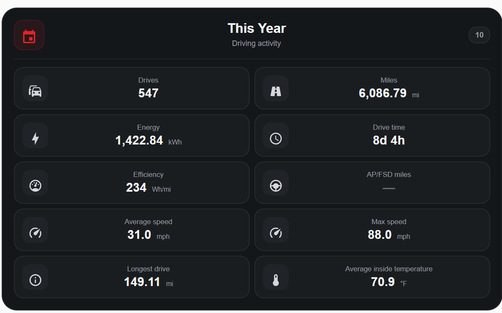

<details>
<summary>Copy YAML</summary>
  
```yaml

type: custom:button-card
grid_options:
  rows: auto
show_name: false
show_icon: false
show_state: false
show_label: false
triggers_update:
  - sensor.car_coaster_drives_this_year
  - sensor.car_coaster_miles_this_year
  - sensor.car_coaster_energy_this_year
  - sensor.car_coaster_drive_time_this_year
  - sensor.car_coaster_efficiency_this_year
  - sensor.car_coaster_battery_used_this_year
  - sensor.car_coaster_ap_fsd_miles_this_year
  - sensor.car_coaster_average_speed_this_year
  - sensor.car_coaster_max_speed_this_year
  - sensor.car_coaster_longest_drive_this_year
  - sensor.car_coaster_average_inside_temperature_this_year
tap_action:
  action: none
hold_action:
  action: none
styles:
  card:
    - width: 100%
    - min-width: 0
    - padding: 12px
    - box-sizing: border-box
    - overflow: hidden
    - border-radius: 16px
    - background: '#14171a'
    - border: 1px solid "#272b2f"
    - box-shadow: none
  grid:
    - grid-template-areas: '"main"'
    - grid-template-columns: minmax(0, 1fr)
    - grid-template-rows: auto
    - width: 100%
  custom_fields:
    main:
      - width: 100%
      - min-width: 0
custom_fields:
  main: |
    [[[
      const ids = ["sensor.car_coaster_drives_this_year", "sensor.car_coaster_miles_this_year", "sensor.car_coaster_energy_this_year", "sensor.car_coaster_drive_time_this_year", "sensor.car_coaster_efficiency_this_year", "sensor.car_coaster_battery_used_this_year", "sensor.car_coaster_ap_fsd_miles_this_year", "sensor.car_coaster_average_speed_this_year", "sensor.car_coaster_max_speed_this_year", "sensor.car_coaster_longest_drive_this_year", "sensor.car_coaster_average_inside_temperature_this_year"];

      const suffix = id => {
        if (id.startsWith('binary_sensor.car_coaster_')) {
          return id.slice('binary_sensor.car_coaster_'.length);
        }
        return id.slice('sensor.car_coaster_'.length);
      };

      const label = id => {
        let name =
          states[id]?.attributes?.friendly_name ||
          suffix(id).replace(/_/g, ' ');

        return name
          .replace(/^Coaster\s*/i, '')
          .replace(/^Car Coaster\s*/i, '')
          .replace(/driVINg/gi, 'driving');
      };

      const iconFor = id => {
        const name = suffix(id);

        if (id.startsWith('binary_sensor.')) return 'mdi:car-tire-alert';
        if (name.includes('ap_fsd')) return 'mdi:steering';
        if (name.includes('tire')) return 'mdi:car-tire-alert';
        if (name.includes('battery_health')) return 'mdi:battery-heart-variant';
        if (name.includes('degradation')) return 'mdi:battery-alert-variant-outline';
        if (name.includes('battery')) return 'mdi:battery';
        if (name.includes('supercharger')) return 'mdi:ev-station';
        if (name.includes('charging')) return 'mdi:ev-plug-tesla';
        if (name.includes('charge')) return 'mdi:battery-charging';
        if (name.includes('cost') || name.includes('invoice')) return 'mdi:currency-usd';
        if (name.includes('energy')) return 'mdi:lightning-bolt';
        if (name.includes('efficiency')) return 'mdi:gauge';
        if (name.includes('speed')) return 'mdi:speedometer';
        if (name.includes('time')) return 'mdi:clock-outline';
        if (name.includes('drives') || name.includes('sessions')) return 'mdi:counter';
        if (name.includes('miles') || name.includes('range') || name.includes('distance')) return 'mdi:road-variant';
        if (name.includes('temperature') || name.includes('_temp_')) return 'mdi:thermometer';
        if (name.includes('sentry')) return 'mdi:shield-car';
        if (name.includes('climate')) return 'mdi:fan';
        if (name.includes('navigation')) return 'mdi:navigation-variant';
        if (name.includes('location') || name.includes('destination') || name.endsWith('_start')) return 'mdi:map-marker';
        if (name.includes('software')) return 'mdi:update';
        if (name.includes('firmware') || name.includes('alert')) return 'mdi:alert-outline';
        if (name.includes('odometer')) return 'mdi:counter';
        if (name.includes('connection')) return 'mdi:signal';
        if (name.includes('wake')) return 'mdi:weather-sunset-up';
        if (name.includes('vehicle_status')) return 'mdi:car-connected';
        return 'mdi:information-outline';
      };

      const format = id => {
        const entity = states[id];

        if (!entity) {
          return { value: '—', unit: '', cls: 'muted' };
        }

        const raw = String(entity.state ?? '').trim();

        if (!raw || raw === 'unknown' || raw === 'unavailable') {
          return { value: '—', unit: '', cls: 'muted' };
        }

        if (id.startsWith('binary_sensor.')) {
          if (raw === 'on') return { value: 'LOW', unit: '', cls: 'danger' };
          if (raw === 'off') return { value: 'NORMAL', unit: '', cls: 'good' };
        }

        const unit = entity.attributes?.unit_of_measurement || '';
        const deviceClass = entity.attributes?.device_class || '';
        const number = Number(raw);

        if (
          deviceClass === 'timestamp' ||
          (raw.includes('T') && !Number.isFinite(number))
        ) {
          const date = new Date(raw);
          if (!Number.isNaN(date.getTime())) {
            return {
              value: date.toLocaleString(undefined, {
                month: 'short',
                day: 'numeric',
                hour: 'numeric',
                minute: '2-digit'
              }),
              unit: '',
              cls: ''
            };
          }
        }

        if (Number.isFinite(number)) {
          if (unit === 'USD' || unit === '$') {
            return {
              value: `$${number.toLocaleString(undefined, {
                minimumFractionDigits: 2,
                maximumFractionDigits: 2
              })}`,
              unit: '',
              cls: ''
            };
          }

          if (unit === 'min') {
            const absolute = Math.abs(number);
            if (absolute >= 1440) {
              const days = Math.floor(absolute / 1440);
              const hours = Math.floor((absolute % 1440) / 60);
              return {
                value: `${number < 0 ? '-' : ''}${days}d ${hours}h`,
                unit: '',
                cls: ''
              };
            }
            if (absolute >= 60) {
              const hours = Math.floor(absolute / 60);
              const minutes = Math.round(absolute % 60);
              return {
                value: `${number < 0 ? '-' : ''}${hours}h ${minutes}m`,
                unit: '',
                cls: ''
              };
            }
          }

          let decimals = 1;
          if (unit === 'kWh' || unit === 'mi') decimals = 2;
          if (unit === 'Wh/mi' || unit === 'kW') decimals = 0;
          if (!unit) decimals = Number.isInteger(number) ? 0 : 1;

          return {
            value: number.toLocaleString(undefined, {
              minimumFractionDigits: decimals,
              maximumFractionDigits: decimals
            }),
            unit,
            cls: number < 0 ? 'danger' : ''
          };
        }

        return { value: raw, unit: '', cls: '' };
      };

      const metrics = ids.map(id => {
        const data = format(id);

        return `
          <div class="metric">
            <div class="metric-icon">
              <ha-icon icon="${iconFor(id)}"></ha-icon>
            </div>
            <div class="metric-copy">
              <div class="metric-label">${label(id)}</div>
              <div class="metric-value ${data.cls}">
                ${data.value}
                ${data.unit ? `<span class="unit">${data.unit}</span>` : ''}
              </div>
            </div>
          </div>
        `;
      }).join('');

      return `
        <style>
          .card {
            --text: #f4f4f4;
            --secondary: #969ba1;
            --muted: #666c72;
            --red: #e82127;
            --good: #4cd964;
            --danger: #ff514b;
            width: 100%;
            min-width: 0;
            color: var(--text);
            font-family: Arial, Helvetica, sans-serif;
          }

          .header {
            display: grid;
            grid-template-columns: 32px minmax(0,1fr) auto;
            gap: 9px;
            align-items: center;
            padding-bottom: 9px;
            margin-bottom: 8px;
            border-bottom: 1px solid rgba(255,255,255,.06);
          }

          .header-icon {
            width: 30px;
            height: 30px;
            display: flex;
            align-items: center;
            justify-content: center;
            border-radius: 9px;
            background: rgba(232,33,39,.09);
            border: 1px solid rgba(232,33,39,.15);
          }

          .header-icon ha-icon {
            width: 17px;
            height: 17px;
            color: var(--red);
          }

          .title {
            overflow: hidden;
            text-overflow: ellipsis;
            white-space: nowrap;
            font-size: 14px;
            line-height: 1;
            font-weight: 650;
          }

          .subtitle {
            margin-top: 4px;
            overflow: hidden;
            text-overflow: ellipsis;
            white-space: nowrap;
            font-size: 8px;
            color: var(--secondary);
          }

          .count {
            min-width: 20px;
            height: 18px;
            padding: 0 6px;
            display: flex;
            align-items: center;
            justify-content: center;
            box-sizing: border-box;
            border-radius: 8px;
            background: #1d2023;
            border: 1px solid #272b2f;
            font-size: 8px;
            color: var(--secondary);
          }

          .metrics {
            display: grid;
            grid-template-columns: repeat(2, minmax(0,1fr));
            gap: 5px;
          }

          .metric {
            min-width: 0;
            display: grid;
            grid-template-columns: 28px minmax(0,1fr);
            gap: 7px;
            align-items: center;
            padding: 8px;
            box-sizing: border-box;
            border-radius: 10px;
            background: #1a1d20;
            border: 1px solid rgba(255,255,255,.06);
          }

          .metric-icon {
            width: 27px;
            height: 27px;
            display: flex;
            align-items: center;
            justify-content: center;
            border-radius: 8px;
            background: #202428;
          }

          .metric-icon ha-icon {
            width: 15px;
            height: 15px;
            color: #d5d7da;
          }

          .metric-copy {
            min-width: 0;
          }

          .metric-label {
            margin-bottom: 3px;
            overflow: hidden;
            text-overflow: ellipsis;
            white-space: nowrap;
            font-size: 7.5px;
            color: var(--secondary);
          }

          .metric-value {
            overflow: hidden;
            text-overflow: ellipsis;
            white-space: nowrap;
            font-size: 13px;
            line-height: 1;
            font-weight: 650;
          }

          .unit {
            margin-left: 2px;
            font-size: 7px;
            font-weight: 500;
            color: var(--secondary);
          }

          .muted { color: var(--muted); }
          .good { color: var(--good); }
          .danger { color: var(--danger); }

          @media (max-width: 700px) {
            .metrics {
              grid-template-columns: repeat(2, minmax(0,1fr));
            }
          }
        </style>

        <div class="card">
          <div class="header">
            <div class="header-icon">
              <ha-icon icon="mdi:calendar"></ha-icon>
            </div>
            <div>
              <div class="title">This Year</div>
              <div class="subtitle">Driving activity</div>
            </div>
            <div class="count">${ids.length}</div>
          </div>
          <div class="metrics">
            ${metrics}
          </div>
        </div>
      `;
    ]]]


```

</details>

---

## Last Drive

Most recent completed trip with distance, time, energy, efficiency, AP/FSD, speed, battery usage, temperatures, range use, route details, and path-point count.

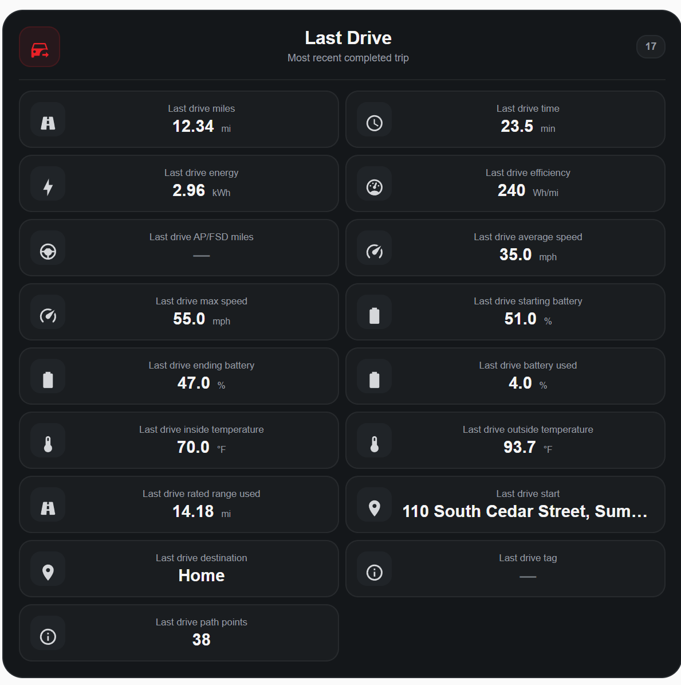

<details>
<summary>Copy YAML</summary>
  
```yaml

type: custom:button-card
grid_options:
  rows: auto
show_name: false
show_icon: false
show_state: false
show_label: false
triggers_update:
  - sensor.car_coaster_last_drive_miles
  - sensor.car_coaster_last_drive_time
  - sensor.car_coaster_last_drive_energy
  - sensor.car_coaster_last_drive_efficiency
  - sensor.car_coaster_last_drive_ap_fsd_miles
  - sensor.car_coaster_last_drive_average_speed
  - sensor.car_coaster_last_drive_max_speed
  - sensor.car_coaster_last_drive_starting_battery
  - sensor.car_coaster_last_drive_ending_battery
  - sensor.car_coaster_last_drive_battery_used
  - sensor.car_coaster_last_drive_inside_temperature
  - sensor.car_coaster_last_drive_outside_temperature
  - sensor.car_coaster_last_drive_rated_range_used
  - sensor.car_coaster_last_drive_start
  - sensor.car_coaster_last_drive_destination
  - sensor.car_coaster_last_drive_tag
  - sensor.car_coaster_last_drive_path_points
tap_action:
  action: none
hold_action:
  action: none
styles:
  card:
    - width: 100%
    - min-width: 0
    - padding: 12px
    - box-sizing: border-box
    - overflow: hidden
    - border-radius: 16px
    - background: '#14171a'
    - border: 1px solid "#272b2f"
    - box-shadow: none
  grid:
    - grid-template-areas: '"main"'
    - grid-template-columns: minmax(0, 1fr)
    - grid-template-rows: auto
    - width: 100%
  custom_fields:
    main:
      - width: 100%
      - min-width: 0
custom_fields:
  main: |
    [[[
      const ids = ["sensor.car_coaster_last_drive_miles", "sensor.car_coaster_last_drive_time", "sensor.car_coaster_last_drive_energy", "sensor.car_coaster_last_drive_efficiency", "sensor.car_coaster_last_drive_ap_fsd_miles", "sensor.car_coaster_last_drive_average_speed", "sensor.car_coaster_last_drive_max_speed", "sensor.car_coaster_last_drive_starting_battery", "sensor.car_coaster_last_drive_ending_battery", "sensor.car_coaster_last_drive_battery_used", "sensor.car_coaster_last_drive_inside_temperature", "sensor.car_coaster_last_drive_outside_temperature", "sensor.car_coaster_last_drive_rated_range_used", "sensor.car_coaster_last_drive_start", "sensor.car_coaster_last_drive_destination", "sensor.car_coaster_last_drive_tag", "sensor.car_coaster_last_drive_path_points"];

      const suffix = id => {
        if (id.startsWith('binary_sensor.car_coaster_')) {
          return id.slice('binary_sensor.car_coaster_'.length);
        }
        return id.slice('sensor.car_coaster_'.length);
      };

      const label = id => {
        let name =
          states[id]?.attributes?.friendly_name ||
          suffix(id).replace(/_/g, ' ');

        return name
          .replace(/^Coaster\s*/i, '')
          .replace(/^Car Coaster\s*/i, '')
          .replace(/driVINg/gi, 'driving');
      };

      const iconFor = id => {
        const name = suffix(id);

        if (id.startsWith('binary_sensor.')) return 'mdi:car-tire-alert';
        if (name.includes('ap_fsd')) return 'mdi:steering';
        if (name.includes('tire')) return 'mdi:car-tire-alert';
        if (name.includes('battery_health')) return 'mdi:battery-heart-variant';
        if (name.includes('degradation')) return 'mdi:battery-alert-variant-outline';
        if (name.includes('battery')) return 'mdi:battery';
        if (name.includes('supercharger')) return 'mdi:ev-station';
        if (name.includes('charging')) return 'mdi:ev-plug-tesla';
        if (name.includes('charge')) return 'mdi:battery-charging';
        if (name.includes('cost') || name.includes('invoice')) return 'mdi:currency-usd';
        if (name.includes('energy')) return 'mdi:lightning-bolt';
        if (name.includes('efficiency')) return 'mdi:gauge';
        if (name.includes('speed')) return 'mdi:speedometer';
        if (name.includes('time')) return 'mdi:clock-outline';
        if (name.includes('drives') || name.includes('sessions')) return 'mdi:counter';
        if (name.includes('miles') || name.includes('range') || name.includes('distance')) return 'mdi:road-variant';
        if (name.includes('temperature') || name.includes('_temp_')) return 'mdi:thermometer';
        if (name.includes('sentry')) return 'mdi:shield-car';
        if (name.includes('climate')) return 'mdi:fan';
        if (name.includes('navigation')) return 'mdi:navigation-variant';
        if (name.includes('location') || name.includes('destination') || name.endsWith('_start')) return 'mdi:map-marker';
        if (name.includes('software')) return 'mdi:update';
        if (name.includes('firmware') || name.includes('alert')) return 'mdi:alert-outline';
        if (name.includes('odometer')) return 'mdi:counter';
        if (name.includes('connection')) return 'mdi:signal';
        if (name.includes('wake')) return 'mdi:weather-sunset-up';
        if (name.includes('vehicle_status')) return 'mdi:car-connected';
        return 'mdi:information-outline';
      };

      const format = id => {
        const entity = states[id];

        if (!entity) {
          return { value: '—', unit: '', cls: 'muted' };
        }

        const raw = String(entity.state ?? '').trim();

        if (!raw || raw === 'unknown' || raw === 'unavailable') {
          return { value: '—', unit: '', cls: 'muted' };
        }

        if (id.startsWith('binary_sensor.')) {
          if (raw === 'on') return { value: 'LOW', unit: '', cls: 'danger' };
          if (raw === 'off') return { value: 'NORMAL', unit: '', cls: 'good' };
        }

        const unit = entity.attributes?.unit_of_measurement || '';
        const deviceClass = entity.attributes?.device_class || '';
        const number = Number(raw);

        if (
          deviceClass === 'timestamp' ||
          (raw.includes('T') && !Number.isFinite(number))
        ) {
          const date = new Date(raw);
          if (!Number.isNaN(date.getTime())) {
            return {
              value: date.toLocaleString(undefined, {
                month: 'short',
                day: 'numeric',
                hour: 'numeric',
                minute: '2-digit'
              }),
              unit: '',
              cls: ''
            };
          }
        }

        if (Number.isFinite(number)) {
          if (unit === 'USD' || unit === '$') {
            return {
              value: `$${number.toLocaleString(undefined, {
                minimumFractionDigits: 2,
                maximumFractionDigits: 2
              })}`,
              unit: '',
              cls: ''
            };
          }

          if (unit === 'min') {
            const absolute = Math.abs(number);
            if (absolute >= 1440) {
              const days = Math.floor(absolute / 1440);
              const hours = Math.floor((absolute % 1440) / 60);
              return {
                value: `${number < 0 ? '-' : ''}${days}d ${hours}h`,
                unit: '',
                cls: ''
              };
            }
            if (absolute >= 60) {
              const hours = Math.floor(absolute / 60);
              const minutes = Math.round(absolute % 60);
              return {
                value: `${number < 0 ? '-' : ''}${hours}h ${minutes}m`,
                unit: '',
                cls: ''
              };
            }
          }

          let decimals = 1;
          if (unit === 'kWh' || unit === 'mi') decimals = 2;
          if (unit === 'Wh/mi' || unit === 'kW') decimals = 0;
          if (!unit) decimals = Number.isInteger(number) ? 0 : 1;

          return {
            value: number.toLocaleString(undefined, {
              minimumFractionDigits: decimals,
              maximumFractionDigits: decimals
            }),
            unit,
            cls: number < 0 ? 'danger' : ''
          };
        }

        return { value: raw, unit: '', cls: '' };
      };

      const metrics = ids.map(id => {
        const data = format(id);

        return `
          <div class="metric">
            <div class="metric-icon">
              <ha-icon icon="${iconFor(id)}"></ha-icon>
            </div>
            <div class="metric-copy">
              <div class="metric-label">${label(id)}</div>
              <div class="metric-value ${data.cls}">
                ${data.value}
                ${data.unit ? `<span class="unit">${data.unit}</span>` : ''}
              </div>
            </div>
          </div>
        `;
      }).join('');

      return `
        <style>
          .card {
            --text: #f4f4f4;
            --secondary: #969ba1;
            --muted: #666c72;
            --red: #e82127;
            --good: #4cd964;
            --danger: #ff514b;
            width: 100%;
            min-width: 0;
            color: var(--text);
            font-family: Arial, Helvetica, sans-serif;
          }

          .header {
            display: grid;
            grid-template-columns: 32px minmax(0,1fr) auto;
            gap: 9px;
            align-items: center;
            padding-bottom: 9px;
            margin-bottom: 8px;
            border-bottom: 1px solid rgba(255,255,255,.06);
          }

          .header-icon {
            width: 30px;
            height: 30px;
            display: flex;
            align-items: center;
            justify-content: center;
            border-radius: 9px;
            background: rgba(232,33,39,.09);
            border: 1px solid rgba(232,33,39,.15);
          }

          .header-icon ha-icon {
            width: 17px;
            height: 17px;
            color: var(--red);
          }

          .title {
            overflow: hidden;
            text-overflow: ellipsis;
            white-space: nowrap;
            font-size: 14px;
            line-height: 1;
            font-weight: 650;
          }

          .subtitle {
            margin-top: 4px;
            overflow: hidden;
            text-overflow: ellipsis;
            white-space: nowrap;
            font-size: 8px;
            color: var(--secondary);
          }

          .count {
            min-width: 20px;
            height: 18px;
            padding: 0 6px;
            display: flex;
            align-items: center;
            justify-content: center;
            box-sizing: border-box;
            border-radius: 8px;
            background: #1d2023;
            border: 1px solid #272b2f;
            font-size: 8px;
            color: var(--secondary);
          }

          .metrics {
            display: grid;
            grid-template-columns: repeat(3, minmax(0,1fr));
            gap: 5px;
          }

          .metric {
            min-width: 0;
            display: grid;
            grid-template-columns: 28px minmax(0,1fr);
            gap: 7px;
            align-items: center;
            padding: 8px;
            box-sizing: border-box;
            border-radius: 10px;
            background: #1a1d20;
            border: 1px solid rgba(255,255,255,.06);
          }

          .metric-icon {
            width: 27px;
            height: 27px;
            display: flex;
            align-items: center;
            justify-content: center;
            border-radius: 8px;
            background: #202428;
          }

          .metric-icon ha-icon {
            width: 15px;
            height: 15px;
            color: #d5d7da;
          }

          .metric-copy {
            min-width: 0;
          }

          .metric-label {
            margin-bottom: 3px;
            overflow: hidden;
            text-overflow: ellipsis;
            white-space: nowrap;
            font-size: 7.5px;
            color: var(--secondary);
          }

          .metric-value {
            overflow: hidden;
            text-overflow: ellipsis;
            white-space: nowrap;
            font-size: 13px;
            line-height: 1;
            font-weight: 650;
          }

          .unit {
            margin-left: 2px;
            font-size: 7px;
            font-weight: 500;
            color: var(--secondary);
          }

          .muted { color: var(--muted); }
          .good { color: var(--good); }
          .danger { color: var(--danger); }

          @media (max-width: 700px) {
            .metrics {
              grid-template-columns: repeat(2, minmax(0,1fr));
            }
          }
        </style>

        <div class="card">
          <div class="header">
            <div class="header-icon">
              <ha-icon icon="mdi:car-arrow-right"></ha-icon>
            </div>
            <div>
              <div class="title">Last Drive</div>
              <div class="subtitle">Most recent completed trip</div>
            </div>
            <div class="count">${ids.length}</div>
          </div>
          <div class="metrics">
            ${metrics}
          </div>
        </div>
      `;
    ]]]


```

</details>

---

## Drive Energy Factors

A focused consumption-context card for understanding the conditions around the most recent drive. It combines actual battery use, energy consumed, efficiency, and battery-per-mile with outside/cabin temperature, speed, AP/FSD use, battery-pack temperatures, and month/year efficiency comparisons.

The comparison indicators are intended as **context**, not as a claim that any single temperature, speed, or driving condition caused a specific percentage of battery loss.

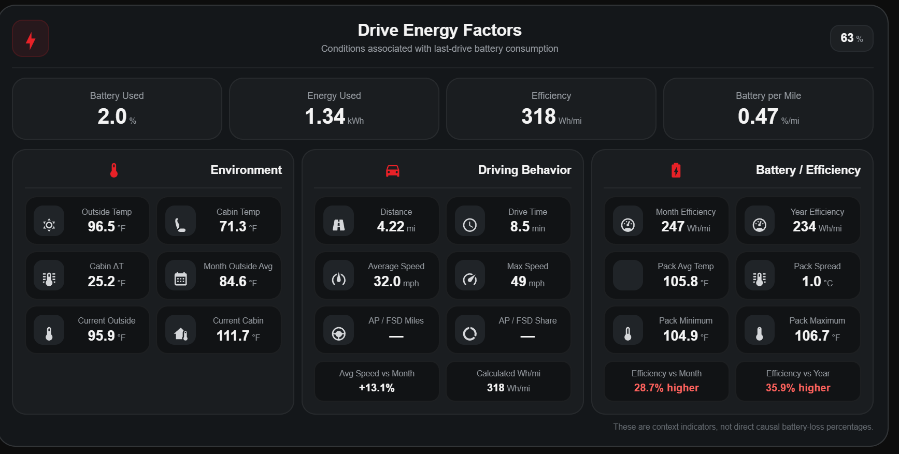

<details>
<summary>Copy YAML</summary>
  
```yaml
type: custom:button-card
grid_options:
  rows: auto
show_name: false
show_icon: false
show_state: false
show_label: false
triggers_update:
  - sensor.car_coaster_consumption_last_charge_at
  - sensor.car_coaster_distance_since_charge
  - sensor.car_coaster_battery_used_since_charge
  - sensor.car_coaster_battery_used_by_driving_since_charge
  - sensor.car_coaster_battery_used_non_driving_since_charge
  - sensor.car_coaster_energy_used_since_charge
  - sensor.car_coaster_energy_used_by_driving_since_charge
  - sensor.car_coaster_energy_used_non_driving_since_charge
  - sensor.car_coaster_driving_energy_share_since_charge
  - sensor.car_coaster_rated_range_used_since_charge
  - sensor.car_coaster_rated_range_used_by_driving_since_charge
  - sensor.car_coaster_ideal_range_used_by_driving_since_charge
tap_action:
  action: none
hold_action:
  action: none
styles:
  card:
    - width: 100%
    - min-width: 0
    - padding: 12px
    - box-sizing: border-box
    - overflow: hidden
    - border-radius: 16px
    - background: '#14171a'
    - border: 1px solid "#272b2f"
    - box-shadow: none
  grid:
    - grid-template-areas: '"main"'
    - grid-template-columns: minmax(0, 1fr)
    - grid-template-rows: auto
    - width: 100%
  custom_fields:
    main:
      - width: 100%
      - min-width: 0
custom_fields:
  main: |
    [[[
      const ids = ["sensor.car_coaster_consumption_last_charge_at", "sensor.car_coaster_distance_since_charge", "sensor.car_coaster_battery_used_since_charge", "sensor.car_coaster_battery_used_by_driving_since_charge", "sensor.car_coaster_battery_used_non_driving_since_charge", "sensor.car_coaster_energy_used_since_charge", "sensor.car_coaster_energy_used_by_driving_since_charge", "sensor.car_coaster_energy_used_non_driving_since_charge", "sensor.car_coaster_driving_energy_share_since_charge", "sensor.car_coaster_rated_range_used_since_charge", "sensor.car_coaster_rated_range_used_by_driving_since_charge", "sensor.car_coaster_ideal_range_used_by_driving_since_charge"];

      const suffix = id => {
        if (id.startsWith('binary_sensor.car_coaster_')) {
          return id.slice('binary_sensor.car_coaster_'.length);
        }
        return id.slice('sensor.car_coaster_'.length);
      };

      const label = id => {
        let name =
          states[id]?.attributes?.friendly_name ||
          suffix(id).replace(/_/g, ' ');

        return name
          .replace(/^Coaster\s*/i, '')
          .replace(/^Car Coaster\s*/i, '')
          .replace(/driVINg/gi, 'driving');
      };

      const iconFor = id => {
        const name = suffix(id);

        if (id.startsWith('binary_sensor.')) return 'mdi:car-tire-alert';
        if (name.includes('ap_fsd')) return 'mdi:steering';
        if (name.includes('tire')) return 'mdi:car-tire-alert';
        if (name.includes('battery_health')) return 'mdi:battery-heart-variant';
        if (name.includes('degradation')) return 'mdi:battery-alert-variant-outline';
        if (name.includes('battery')) return 'mdi:battery';
        if (name.includes('supercharger')) return 'mdi:ev-station';
        if (name.includes('charging')) return 'mdi:ev-plug-tesla';
        if (name.includes('charge')) return 'mdi:battery-charging';
        if (name.includes('cost') || name.includes('invoice')) return 'mdi:currency-usd';
        if (name.includes('energy')) return 'mdi:lightning-bolt';
        if (name.includes('efficiency')) return 'mdi:gauge';
        if (name.includes('speed')) return 'mdi:speedometer';
        if (name.includes('time')) return 'mdi:clock-outline';
        if (name.includes('drives') || name.includes('sessions')) return 'mdi:counter';
        if (name.includes('miles') || name.includes('range') || name.includes('distance')) return 'mdi:road-variant';
        if (name.includes('temperature') || name.includes('_temp_')) return 'mdi:thermometer';
        if (name.includes('sentry')) return 'mdi:shield-car';
        if (name.includes('climate')) return 'mdi:fan';
        if (name.includes('navigation')) return 'mdi:navigation-variant';
        if (name.includes('location') || name.includes('destination') || name.endsWith('_start')) return 'mdi:map-marker';
        if (name.includes('software')) return 'mdi:update';
        if (name.includes('firmware') || name.includes('alert')) return 'mdi:alert-outline';
        if (name.includes('odometer')) return 'mdi:counter';
        if (name.includes('connection')) return 'mdi:signal';
        if (name.includes('wake')) return 'mdi:weather-sunset-up';
        if (name.includes('vehicle_status')) return 'mdi:car-connected';
        return 'mdi:information-outline';
      };

      const format = id => {
        const entity = states[id];

        if (!entity) {
          return { value: '—', unit: '', cls: 'muted' };
        }

        const raw = String(entity.state ?? '').trim();

        if (!raw || raw === 'unknown' || raw === 'unavailable') {
          return { value: '—', unit: '', cls: 'muted' };
        }

        if (id.startsWith('binary_sensor.')) {
          if (raw === 'on') return { value: 'LOW', unit: '', cls: 'danger' };
          if (raw === 'off') return { value: 'NORMAL', unit: '', cls: 'good' };
        }

        const unit = entity.attributes?.unit_of_measurement || '';
        const deviceClass = entity.attributes?.device_class || '';
        const number = Number(raw);

        if (
          deviceClass === 'timestamp' ||
          (raw.includes('T') && !Number.isFinite(number))
        ) {
          const date = new Date(raw);
          if (!Number.isNaN(date.getTime())) {
            return {
              value: date.toLocaleString(undefined, {
                month: 'short',
                day: 'numeric',
                hour: 'numeric',
                minute: '2-digit'
              }),
              unit: '',
              cls: ''
            };
          }
        }

        if (Number.isFinite(number)) {
          if (unit === 'USD' || unit === '$') {
            return {
              value: `$${number.toLocaleString(undefined, {
                minimumFractionDigits: 2,
                maximumFractionDigits: 2
              })}`,
              unit: '',
              cls: ''
            };
          }

          if (unit === 'min') {
            const absolute = Math.abs(number);
            if (absolute >= 1440) {
              const days = Math.floor(absolute / 1440);
              const hours = Math.floor((absolute % 1440) / 60);
              return {
                value: `${number < 0 ? '-' : ''}${days}d ${hours}h`,
                unit: '',
                cls: ''
              };
            }
            if (absolute >= 60) {
              const hours = Math.floor(absolute / 60);
              const minutes = Math.round(absolute % 60);
              return {
                value: `${number < 0 ? '-' : ''}${hours}h ${minutes}m`,
                unit: '',
                cls: ''
              };
            }
          }

          let decimals = 1;
          if (unit === 'kWh' || unit === 'mi') decimals = 2;
          if (unit === 'Wh/mi' || unit === 'kW') decimals = 0;
          if (!unit) decimals = Number.isInteger(number) ? 0 : 1;

          return {
            value: number.toLocaleString(undefined, {
              minimumFractionDigits: decimals,
              maximumFractionDigits: decimals
            }),
            unit,
            cls: number < 0 ? 'danger' : ''
          };
        }

        return { value: raw, unit: '', cls: '' };
      };

      const metrics = ids.map(id => {
        const data = format(id);

        return `
          <div class="metric">
            <div class="metric-icon">
              <ha-icon icon="${iconFor(id)}"></ha-icon>
            </div>
            <div class="metric-copy">
              <div class="metric-label">${label(id)}</div>
              <div class="metric-value ${data.cls}">
                ${data.value}
                ${data.unit ? `<span class="unit">${data.unit}</span>` : ''}
              </div>
            </div>
          </div>
        `;
      }).join('');

      return `
        <style>
          .card {
            --text: #f4f4f4;
            --secondary: #969ba1;
            --muted: #666c72;
            --red: #e82127;
            --good: #4cd964;
            --danger: #ff514b;
            width: 100%;
            min-width: 0;
            color: var(--text);
            font-family: Arial, Helvetica, sans-serif;
          }

          .header {
            display: grid;
            grid-template-columns: 32px minmax(0,1fr) auto;
            gap: 9px;
            align-items: center;
            padding-bottom: 9px;
            margin-bottom: 8px;
            border-bottom: 1px solid rgba(255,255,255,.06);
          }

          .header-icon {
            width: 30px;
            height: 30px;
            display: flex;
            align-items: center;
            justify-content: center;
            border-radius: 9px;
            background: rgba(232,33,39,.09);
            border: 1px solid rgba(232,33,39,.15);
          }

          .header-icon ha-icon {
            width: 17px;
            height: 17px;
            color: var(--red);
          }

          .title {
            overflow: hidden;
            text-overflow: ellipsis;
            white-space: nowrap;
            font-size: 14px;
            line-height: 1;
            font-weight: 650;
          }

          .subtitle {
            margin-top: 4px;
            overflow: hidden;
            text-overflow: ellipsis;
            white-space: nowrap;
            font-size: 8px;
            color: var(--secondary);
          }

          .count {
            min-width: 20px;
            height: 18px;
            padding: 0 6px;
            display: flex;
            align-items: center;
            justify-content: center;
            box-sizing: border-box;
            border-radius: 8px;
            background: #1d2023;
            border: 1px solid #272b2f;
            font-size: 8px;
            color: var(--secondary);
          }

          .metrics {
            display: grid;
            grid-template-columns: repeat(2, minmax(0,1fr));
            gap: 5px;
          }

          .metric {
            min-width: 0;
            display: grid;
            grid-template-columns: 28px minmax(0,1fr);
            gap: 7px;
            align-items: center;
            padding: 8px;
            box-sizing: border-box;
            border-radius: 10px;
            background: #1a1d20;
            border: 1px solid rgba(255,255,255,.06);
          }

          .metric-icon {
            width: 27px;
            height: 27px;
            display: flex;
            align-items: center;
            justify-content: center;
            border-radius: 8px;
            background: #202428;
          }

          .metric-icon ha-icon {
            width: 15px;
            height: 15px;
            color: #d5d7da;
          }

          .metric-copy {
            min-width: 0;
          }

          .metric-label {
            margin-bottom: 3px;
            overflow: hidden;
            text-overflow: ellipsis;
            white-space: nowrap;
            font-size: 7.5px;
            color: var(--secondary);
          }

          .metric-value {
            overflow: hidden;
            text-overflow: ellipsis;
            white-space: nowrap;
            font-size: 13px;
            line-height: 1;
            font-weight: 650;
          }

          .unit {
            margin-left: 2px;
            font-size: 7px;
            font-weight: 500;
            color: var(--secondary);
          }

          .muted { color: var(--muted); }
          .good { color: var(--good); }
          .danger { color: var(--danger); }

          @media (max-width: 700px) {
            .metrics {
              grid-template-columns: repeat(2, minmax(0,1fr));
            }
          }
        </style>

        <div class="card">
          <div class="header">
            <div class="header-icon">
              <ha-icon icon="mdi:battery-sync"></ha-icon>
            </div>
            <div>
              <div class="title">Since Last Charge</div>
              <div class="subtitle">Energy use since charging</div>
            </div>
            <div class="count">${ids.length}</div>
          </div>
          <div class="metrics">
            ${metrics}
          </div>
        </div>
      `;
    ]]]


```

</details>

---

## Battery

Battery health, degradation, current/original capacity, maximum range, module temperatures, and long-term capacity/range changes.

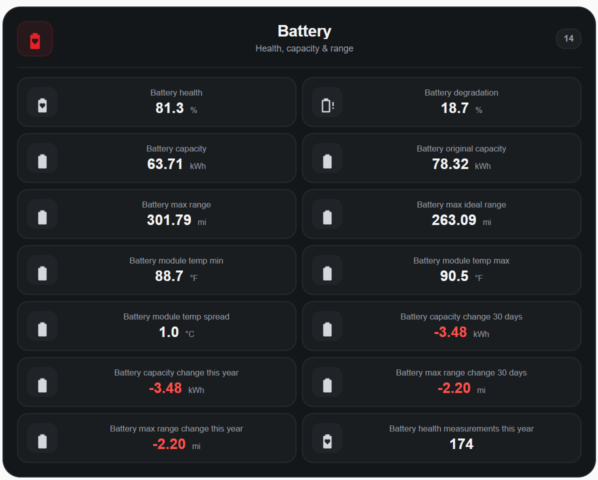

<details>
<summary>Copy YAML</summary>
  
```yaml

type: custom:button-card
grid_options:
  rows: auto
show_name: false
show_icon: false
show_state: false
show_label: false
triggers_update:
  - sensor.car_coaster_battery_health
  - sensor.car_coaster_battery_degradation
  - sensor.car_coaster_battery_capacity
  - sensor.car_coaster_original_battery_capacity
  - sensor.car_coaster_battery_max_range
  - sensor.car_coaster_battery_max_ideal_range
  - sensor.car_coaster_battery_module_temp_min
  - sensor.car_coaster_battery_module_temp_max
  - sensor.car_coaster_battery_module_temp_spread
  - sensor.car_coaster_battery_capacity_change_30_days
  - sensor.car_coaster_battery_capacity_change_this_year
  - sensor.car_coaster_battery_max_range_change_30_days
  - sensor.car_coaster_battery_max_range_change_this_year
  - sensor.car_coaster_battery_health_measurements_this_year
tap_action:
  action: none
hold_action:
  action: none
styles:
  card:
    - width: 100%
    - min-width: 0
    - padding: 12px
    - box-sizing: border-box
    - overflow: hidden
    - border-radius: 16px
    - background: '#14171a'
    - border: 1px solid "#272b2f"
    - box-shadow: none
  grid:
    - grid-template-areas: '"main"'
    - grid-template-columns: minmax(0, 1fr)
    - grid-template-rows: auto
    - width: 100%
  custom_fields:
    main:
      - width: 100%
      - min-width: 0
custom_fields:
  main: |
    [[[
      const ids = ["sensor.car_coaster_battery_health", "sensor.car_coaster_battery_degradation", "sensor.car_coaster_battery_capacity", "sensor.car_coaster_original_battery_capacity", "sensor.car_coaster_battery_max_range", "sensor.car_coaster_battery_max_ideal_range", "sensor.car_coaster_battery_module_temp_min", "sensor.car_coaster_battery_module_temp_max", "sensor.car_coaster_battery_module_temp_spread", "sensor.car_coaster_battery_capacity_change_30_days", "sensor.car_coaster_battery_capacity_change_this_year", "sensor.car_coaster_battery_max_range_change_30_days", "sensor.car_coaster_battery_max_range_change_this_year", "sensor.car_coaster_battery_health_measurements_this_year"];

      const suffix = id => {
        if (id.startsWith('binary_sensor.car_coaster_')) {
          return id.slice('binary_sensor.car_coaster_'.length);
        }
        return id.slice('sensor.car_coaster_'.length);
      };

      const label = id => {
        let name =
          states[id]?.attributes?.friendly_name ||
          suffix(id).replace(/_/g, ' ');

        return name
          .replace(/^Coaster\s*/i, '')
          .replace(/^Car Coaster\s*/i, '')
          .replace(/driVINg/gi, 'driving');
      };

      const iconFor = id => {
        const name = suffix(id);

        if (id.startsWith('binary_sensor.')) return 'mdi:car-tire-alert';
        if (name.includes('ap_fsd')) return 'mdi:steering';
        if (name.includes('tire')) return 'mdi:car-tire-alert';
        if (name.includes('battery_health')) return 'mdi:battery-heart-variant';
        if (name.includes('degradation')) return 'mdi:battery-alert-variant-outline';
        if (name.includes('battery')) return 'mdi:battery';
        if (name.includes('supercharger')) return 'mdi:ev-station';
        if (name.includes('charging')) return 'mdi:ev-plug-tesla';
        if (name.includes('charge')) return 'mdi:battery-charging';
        if (name.includes('cost') || name.includes('invoice')) return 'mdi:currency-usd';
        if (name.includes('energy')) return 'mdi:lightning-bolt';
        if (name.includes('efficiency')) return 'mdi:gauge';
        if (name.includes('speed')) return 'mdi:speedometer';
        if (name.includes('time')) return 'mdi:clock-outline';
        if (name.includes('drives') || name.includes('sessions')) return 'mdi:counter';
        if (name.includes('miles') || name.includes('range') || name.includes('distance')) return 'mdi:road-variant';
        if (name.includes('temperature') || name.includes('_temp_')) return 'mdi:thermometer';
        if (name.includes('sentry')) return 'mdi:shield-car';
        if (name.includes('climate')) return 'mdi:fan';
        if (name.includes('navigation')) return 'mdi:navigation-variant';
        if (name.includes('location') || name.includes('destination') || name.endsWith('_start')) return 'mdi:map-marker';
        if (name.includes('software')) return 'mdi:update';
        if (name.includes('firmware') || name.includes('alert')) return 'mdi:alert-outline';
        if (name.includes('odometer')) return 'mdi:counter';
        if (name.includes('connection')) return 'mdi:signal';
        if (name.includes('wake')) return 'mdi:weather-sunset-up';
        if (name.includes('vehicle_status')) return 'mdi:car-connected';
        return 'mdi:information-outline';
      };

      const format = id => {
        const entity = states[id];

        if (!entity) {
          return { value: '—', unit: '', cls: 'muted' };
        }

        const raw = String(entity.state ?? '').trim();

        if (!raw || raw === 'unknown' || raw === 'unavailable') {
          return { value: '—', unit: '', cls: 'muted' };
        }

        if (id.startsWith('binary_sensor.')) {
          if (raw === 'on') return { value: 'LOW', unit: '', cls: 'danger' };
          if (raw === 'off') return { value: 'NORMAL', unit: '', cls: 'good' };
        }

        const unit = entity.attributes?.unit_of_measurement || '';
        const deviceClass = entity.attributes?.device_class || '';
        const number = Number(raw);

        if (
          deviceClass === 'timestamp' ||
          (raw.includes('T') && !Number.isFinite(number))
        ) {
          const date = new Date(raw);
          if (!Number.isNaN(date.getTime())) {
            return {
              value: date.toLocaleString(undefined, {
                month: 'short',
                day: 'numeric',
                hour: 'numeric',
                minute: '2-digit'
              }),
              unit: '',
              cls: ''
            };
          }
        }

        if (Number.isFinite(number)) {
          if (unit === 'USD' || unit === '$') {
            return {
              value: `$${number.toLocaleString(undefined, {
                minimumFractionDigits: 2,
                maximumFractionDigits: 2
              })}`,
              unit: '',
              cls: ''
            };
          }

          if (unit === 'min') {
            const absolute = Math.abs(number);
            if (absolute >= 1440) {
              const days = Math.floor(absolute / 1440);
              const hours = Math.floor((absolute % 1440) / 60);
              return {
                value: `${number < 0 ? '-' : ''}${days}d ${hours}h`,
                unit: '',
                cls: ''
              };
            }
            if (absolute >= 60) {
              const hours = Math.floor(absolute / 60);
              const minutes = Math.round(absolute % 60);
              return {
                value: `${number < 0 ? '-' : ''}${hours}h ${minutes}m`,
                unit: '',
                cls: ''
              };
            }
          }

          let decimals = 1;
          if (unit === 'kWh' || unit === 'mi') decimals = 2;
          if (unit === 'Wh/mi' || unit === 'kW') decimals = 0;
          if (!unit) decimals = Number.isInteger(number) ? 0 : 1;

          return {
            value: number.toLocaleString(undefined, {
              minimumFractionDigits: decimals,
              maximumFractionDigits: decimals
            }),
            unit,
            cls: number < 0 ? 'danger' : ''
          };
        }

        return { value: raw, unit: '', cls: '' };
      };

      const metrics = ids.map(id => {
        const data = format(id);

        return `
          <div class="metric">
            <div class="metric-icon">
              <ha-icon icon="${iconFor(id)}"></ha-icon>
            </div>
            <div class="metric-copy">
              <div class="metric-label">${label(id)}</div>
              <div class="metric-value ${data.cls}">
                ${data.value}
                ${data.unit ? `<span class="unit">${data.unit}</span>` : ''}
              </div>
            </div>
          </div>
        `;
      }).join('');

      return `
        <style>
          .card {
            --text: #f4f4f4;
            --secondary: #969ba1;
            --muted: #666c72;
            --red: #e82127;
            --good: #4cd964;
            --danger: #ff514b;
            width: 100%;
            min-width: 0;
            color: var(--text);
            font-family: Arial, Helvetica, sans-serif;
          }

          .header {
            display: grid;
            grid-template-columns: 32px minmax(0,1fr) auto;
            gap: 9px;
            align-items: center;
            padding-bottom: 9px;
            margin-bottom: 8px;
            border-bottom: 1px solid rgba(255,255,255,.06);
          }

          .header-icon {
            width: 30px;
            height: 30px;
            display: flex;
            align-items: center;
            justify-content: center;
            border-radius: 9px;
            background: rgba(232,33,39,.09);
            border: 1px solid rgba(232,33,39,.15);
          }

          .header-icon ha-icon {
            width: 17px;
            height: 17px;
            color: var(--red);
          }

          .title {
            overflow: hidden;
            text-overflow: ellipsis;
            white-space: nowrap;
            font-size: 14px;
            line-height: 1;
            font-weight: 650;
          }

          .subtitle {
            margin-top: 4px;
            overflow: hidden;
            text-overflow: ellipsis;
            white-space: nowrap;
            font-size: 8px;
            color: var(--secondary);
          }

          .count {
            min-width: 20px;
            height: 18px;
            padding: 0 6px;
            display: flex;
            align-items: center;
            justify-content: center;
            box-sizing: border-box;
            border-radius: 8px;
            background: #1d2023;
            border: 1px solid #272b2f;
            font-size: 8px;
            color: var(--secondary);
          }

          .metrics {
            display: grid;
            grid-template-columns: repeat(3, minmax(0,1fr));
            gap: 5px;
          }

          .metric {
            min-width: 0;
            display: grid;
            grid-template-columns: 28px minmax(0,1fr);
            gap: 7px;
            align-items: center;
            padding: 8px;
            box-sizing: border-box;
            border-radius: 10px;
            background: #1a1d20;
            border: 1px solid rgba(255,255,255,.06);
          }

          .metric-icon {
            width: 27px;
            height: 27px;
            display: flex;
            align-items: center;
            justify-content: center;
            border-radius: 8px;
            background: #202428;
          }

          .metric-icon ha-icon {
            width: 15px;
            height: 15px;
            color: #d5d7da;
          }

          .metric-copy {
            min-width: 0;
          }

          .metric-label {
            margin-bottom: 3px;
            overflow: hidden;
            text-overflow: ellipsis;
            white-space: nowrap;
            font-size: 7.5px;
            color: var(--secondary);
          }

          .metric-value {
            overflow: hidden;
            text-overflow: ellipsis;
            white-space: nowrap;
            font-size: 13px;
            line-height: 1;
            font-weight: 650;
          }

          .unit {
            margin-left: 2px;
            font-size: 7px;
            font-weight: 500;
            color: var(--secondary);
          }

          .muted { color: var(--muted); }
          .good { color: var(--good); }
          .danger { color: var(--danger); }

          @media (max-width: 700px) {
            .metrics {
              grid-template-columns: repeat(2, minmax(0,1fr));
            }
          }
        </style>

        <div class="card">
          <div class="header">
            <div class="header-icon">
              <ha-icon icon="mdi:battery-heart-variant"></ha-icon>
            </div>
            <div>
              <div class="title">Battery</div>
              <div class="subtitle">Health, capacity & range</div>
            </div>
            <div class="count">${ids.length}</div>
          </div>
          <div class="metrics">
            ${metrics}
          </div>
        </div>
      `;
    ]]]


```

</details>

---

## Lifetime

Version 0.4.0 adds a Tesla-style Lifetime card that separates **true vehicle lifetime counters** from **Tessie recorded lifetime** history. The public example uses a configurable entity prefix so it can be reused with any vehicle.

**[View the Lifetime card YAML →](lifetime-card.yaml)**

The card includes vehicle odometer and lifetime energy, recorded driving/AP-FSD totals, charging and Supercharging totals, idle/vampire-drain totals, and battery-history changes. Once a public-safe screenshot is available, it can be added here as `screenshots/lifetime.png`.

## Idle — Today

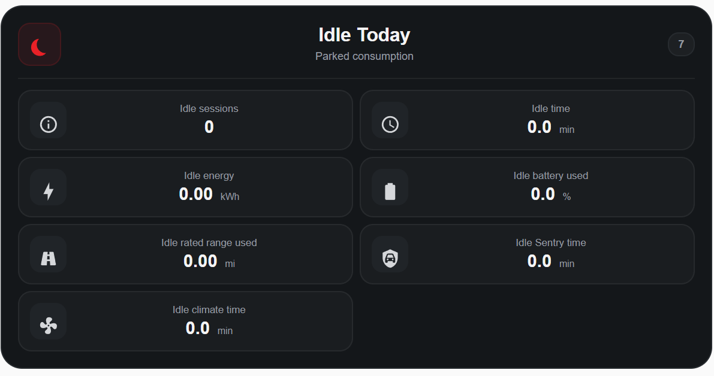

<details>
<summary>Copy YAML</summary>
  
```yaml

type: custom:button-card
grid_options:
  rows: auto
show_name: false
show_icon: false
show_state: false
show_label: false
triggers_update:
  - sensor.car_coaster_battery_health
  - sensor.car_coaster_battery_degradation
  - sensor.car_coaster_battery_capacity
  - sensor.car_coaster_original_battery_capacity
  - sensor.car_coaster_battery_max_range
  - sensor.car_coaster_battery_max_ideal_range
  - sensor.car_coaster_battery_module_temp_min
  - sensor.car_coaster_battery_module_temp_max
  - sensor.car_coaster_battery_module_temp_spread
  - sensor.car_coaster_battery_capacity_change_30_days
  - sensor.car_coaster_battery_capacity_change_this_year
  - sensor.car_coaster_battery_max_range_change_30_days
  - sensor.car_coaster_battery_max_range_change_this_year
  - sensor.car_coaster_battery_health_measurements_this_year
tap_action:
  action: none
hold_action:
  action: none
styles:
  card:
    - width: 100%
    - min-width: 0
    - padding: 12px
    - box-sizing: border-box
    - overflow: hidden
    - border-radius: 16px
    - background: '#14171a'
    - border: 1px solid "#272b2f"
    - box-shadow: none
  grid:
    - grid-template-areas: '"main"'
    - grid-template-columns: minmax(0, 1fr)
    - grid-template-rows: auto
    - width: 100%
  custom_fields:
    main:
      - width: 100%
      - min-width: 0
custom_fields:
  main: |
    [[[
      const ids = ["sensor.car_coaster_battery_health", "sensor.car_coaster_battery_degradation", "sensor.car_coaster_battery_capacity", "sensor.car_coaster_original_battery_capacity", "sensor.car_coaster_battery_max_range", "sensor.car_coaster_battery_max_ideal_range", "sensor.car_coaster_battery_module_temp_min", "sensor.car_coaster_battery_module_temp_max", "sensor.car_coaster_battery_module_temp_spread", "sensor.car_coaster_battery_capacity_change_30_days", "sensor.car_coaster_battery_capacity_change_this_year", "sensor.car_coaster_battery_max_range_change_30_days", "sensor.car_coaster_battery_max_range_change_this_year", "sensor.car_coaster_battery_health_measurements_this_year"];

      const suffix = id => {
        if (id.startsWith('binary_sensor.car_coaster_')) {
          return id.slice('binary_sensor.car_coaster_'.length);
        }
        return id.slice('sensor.car_coaster_'.length);
      };

      const label = id => {
        let name =
          states[id]?.attributes?.friendly_name ||
          suffix(id).replace(/_/g, ' ');

        return name
          .replace(/^Coaster\s*/i, '')
          .replace(/^Car Coaster\s*/i, '')
          .replace(/driVINg/gi, 'driving');
      };

      const iconFor = id => {
        const name = suffix(id);

        if (id.startsWith('binary_sensor.')) return 'mdi:car-tire-alert';
        if (name.includes('ap_fsd')) return 'mdi:steering';
        if (name.includes('tire')) return 'mdi:car-tire-alert';
        if (name.includes('battery_health')) return 'mdi:battery-heart-variant';
        if (name.includes('degradation')) return 'mdi:battery-alert-variant-outline';
        if (name.includes('battery')) return 'mdi:battery';
        if (name.includes('supercharger')) return 'mdi:ev-station';
        if (name.includes('charging')) return 'mdi:ev-plug-tesla';
        if (name.includes('charge')) return 'mdi:battery-charging';
        if (name.includes('cost') || name.includes('invoice')) return 'mdi:currency-usd';
        if (name.includes('energy')) return 'mdi:lightning-bolt';
        if (name.includes('efficiency')) return 'mdi:gauge';
        if (name.includes('speed')) return 'mdi:speedometer';
        if (name.includes('time')) return 'mdi:clock-outline';
        if (name.includes('drives') || name.includes('sessions')) return 'mdi:counter';
        if (name.includes('miles') || name.includes('range') || name.includes('distance')) return 'mdi:road-variant';
        if (name.includes('temperature') || name.includes('_temp_')) return 'mdi:thermometer';
        if (name.includes('sentry')) return 'mdi:shield-car';
        if (name.includes('climate')) return 'mdi:fan';
        if (name.includes('navigation')) return 'mdi:navigation-variant';
        if (name.includes('location') || name.includes('destination') || name.endsWith('_start')) return 'mdi:map-marker';
        if (name.includes('software')) return 'mdi:update';
        if (name.includes('firmware') || name.includes('alert')) return 'mdi:alert-outline';
        if (name.includes('odometer')) return 'mdi:counter';
        if (name.includes('connection')) return 'mdi:signal';
        if (name.includes('wake')) return 'mdi:weather-sunset-up';
        if (name.includes('vehicle_status')) return 'mdi:car-connected';
        return 'mdi:information-outline';
      };

      const format = id => {
        const entity = states[id];

        if (!entity) {
          return { value: '—', unit: '', cls: 'muted' };
        }

        const raw = String(entity.state ?? '').trim();

        if (!raw || raw === 'unknown' || raw === 'unavailable') {
          return { value: '—', unit: '', cls: 'muted' };
        }

        if (id.startsWith('binary_sensor.')) {
          if (raw === 'on') return { value: 'LOW', unit: '', cls: 'danger' };
          if (raw === 'off') return { value: 'NORMAL', unit: '', cls: 'good' };
        }

        const unit = entity.attributes?.unit_of_measurement || '';
        const deviceClass = entity.attributes?.device_class || '';
        const number = Number(raw);

        if (
          deviceClass === 'timestamp' ||
          (raw.includes('T') && !Number.isFinite(number))
        ) {
          const date = new Date(raw);
          if (!Number.isNaN(date.getTime())) {
            return {
              value: date.toLocaleString(undefined, {
                month: 'short',
                day: 'numeric',
                hour: 'numeric',
                minute: '2-digit'
              }),
              unit: '',
              cls: ''
            };
          }
        }

        if (Number.isFinite(number)) {
          if (unit === 'USD' || unit === '$') {
            return {
              value: `$${number.toLocaleString(undefined, {
                minimumFractionDigits: 2,
                maximumFractionDigits: 2
              })}`,
              unit: '',
              cls: ''
            };
          }

          if (unit === 'min') {
            const absolute = Math.abs(number);
            if (absolute >= 1440) {
              const days = Math.floor(absolute / 1440);
              const hours = Math.floor((absolute % 1440) / 60);
              return {
                value: `${number < 0 ? '-' : ''}${days}d ${hours}h`,
                unit: '',
                cls: ''
              };
            }
            if (absolute >= 60) {
              const hours = Math.floor(absolute / 60);
              const minutes = Math.round(absolute % 60);
              return {
                value: `${number < 0 ? '-' : ''}${hours}h ${minutes}m`,
                unit: '',
                cls: ''
              };
            }
          }

          let decimals = 1;
          if (unit === 'kWh' || unit === 'mi') decimals = 2;
          if (unit === 'Wh/mi' || unit === 'kW') decimals = 0;
          if (!unit) decimals = Number.isInteger(number) ? 0 : 1;

          return {
            value: number.toLocaleString(undefined, {
              minimumFractionDigits: decimals,
              maximumFractionDigits: decimals
            }),
            unit,
            cls: number < 0 ? 'danger' : ''
          };
        }

        return { value: raw, unit: '', cls: '' };
      };

      const metrics = ids.map(id => {
        const data = format(id);

        return `
          <div class="metric">
            <div class="metric-icon">
              <ha-icon icon="${iconFor(id)}"></ha-icon>
            </div>
            <div class="metric-copy">
              <div class="metric-label">${label(id)}</div>
              <div class="metric-value ${data.cls}">
                ${data.value}
                ${data.unit ? `<span class="unit">${data.unit}</span>` : ''}
              </div>
            </div>
          </div>
        `;
      }).join('');

      return `
        <style>
          .card {
            --text: #f4f4f4;
            --secondary: #969ba1;
            --muted: #666c72;
            --red: #e82127;
            --good: #4cd964;
            --danger: #ff514b;
            width: 100%;
            min-width: 0;
            color: var(--text);
            font-family: Arial, Helvetica, sans-serif;
          }

          .header {
            display: grid;
            grid-template-columns: 32px minmax(0,1fr) auto;
            gap: 9px;
            align-items: center;
            padding-bottom: 9px;
            margin-bottom: 8px;
            border-bottom: 1px solid rgba(255,255,255,.06);
          }

          .header-icon {
            width: 30px;
            height: 30px;
            display: flex;
            align-items: center;
            justify-content: center;
            border-radius: 9px;
            background: rgba(232,33,39,.09);
            border: 1px solid rgba(232,33,39,.15);
          }

          .header-icon ha-icon {
            width: 17px;
            height: 17px;
            color: var(--red);
          }

          .title {
            overflow: hidden;
            text-overflow: ellipsis;
            white-space: nowrap;
            font-size: 14px;
            line-height: 1;
            font-weight: 650;
          }

          .subtitle {
            margin-top: 4px;
            overflow: hidden;
            text-overflow: ellipsis;
            white-space: nowrap;
            font-size: 8px;
            color: var(--secondary);
          }

          .count {
            min-width: 20px;
            height: 18px;
            padding: 0 6px;
            display: flex;
            align-items: center;
            justify-content: center;
            box-sizing: border-box;
            border-radius: 8px;
            background: #1d2023;
            border: 1px solid #272b2f;
            font-size: 8px;
            color: var(--secondary);
          }

          .metrics {
            display: grid;
            grid-template-columns: repeat(3, minmax(0,1fr));
            gap: 5px;
          }

          .metric {
            min-width: 0;
            display: grid;
            grid-template-columns: 28px minmax(0,1fr);
            gap: 7px;
            align-items: center;
            padding: 8px;
            box-sizing: border-box;
            border-radius: 10px;
            background: #1a1d20;
            border: 1px solid rgba(255,255,255,.06);
          }

          .metric-icon {
            width: 27px;
            height: 27px;
            display: flex;
            align-items: center;
            justify-content: center;
            border-radius: 8px;
            background: #202428;
          }

          .metric-icon ha-icon {
            width: 15px;
            height: 15px;
            color: #d5d7da;
          }

          .metric-copy {
            min-width: 0;
          }

          .metric-label {
            margin-bottom: 3px;
            overflow: hidden;
            text-overflow: ellipsis;
            white-space: nowrap;
            font-size: 7.5px;
            color: var(--secondary);
          }

          .metric-value {
            overflow: hidden;
            text-overflow: ellipsis;
            white-space: nowrap;
            font-size: 13px;
            line-height: 1;
            font-weight: 650;
          }

          .unit {
            margin-left: 2px;
            font-size: 7px;
            font-weight: 500;
            color: var(--secondary);
          }

          .muted { color: var(--muted); }
          .good { color: var(--good); }
          .danger { color: var(--danger); }

          @media (max-width: 700px) {
            .metrics {
              grid-template-columns: repeat(2, minmax(0,1fr));
            }
          }
        </style>

        <div class="card">
          <div class="header">
            <div class="header-icon">
              <ha-icon icon="mdi:battery-heart-variant"></ha-icon>
            </div>
            <div>
              <div class="title">Battery</div>
              <div class="subtitle">Health, capacity & range</div>
            </div>
            <div class="count">${ids.length}</div>
          </div>
          <div class="metrics">
            ${metrics}
          </div>
        </div>
      `;
    ]]]


```

</details>

---

## Idle — This Week

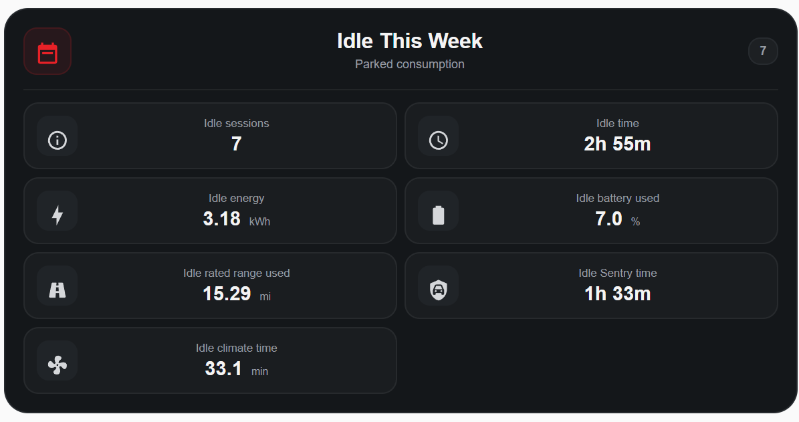

<details>
<summary>Copy YAML</summary>
  
```yaml


```

</details>

---


## Idle — This Month

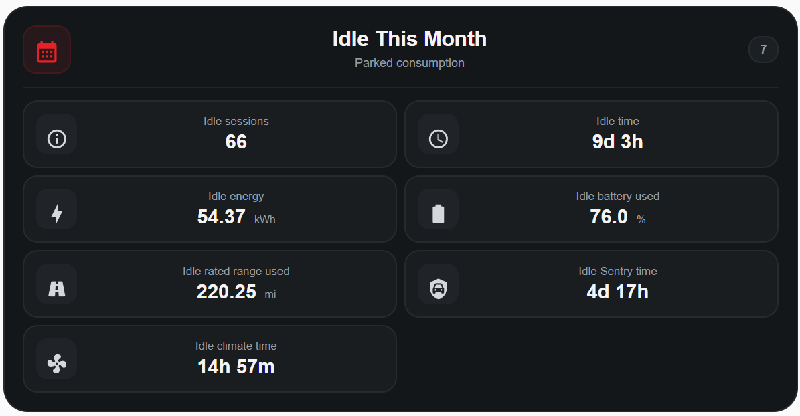

## Idle — This Year

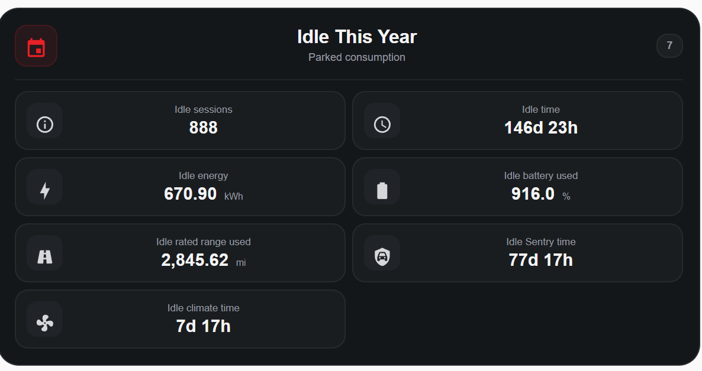

## Last Idle

Most recent parked period including duration, energy, battery change, Sentry/climate share, range use, and location.

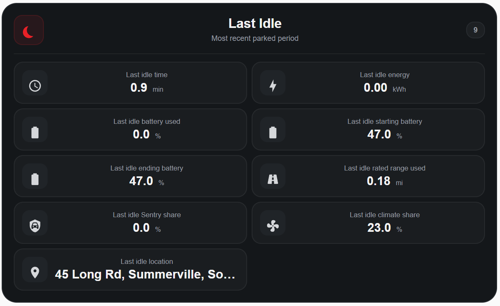

## Charging Cost

Charging cost totals plus the most recent charge cost, energy added, and location.

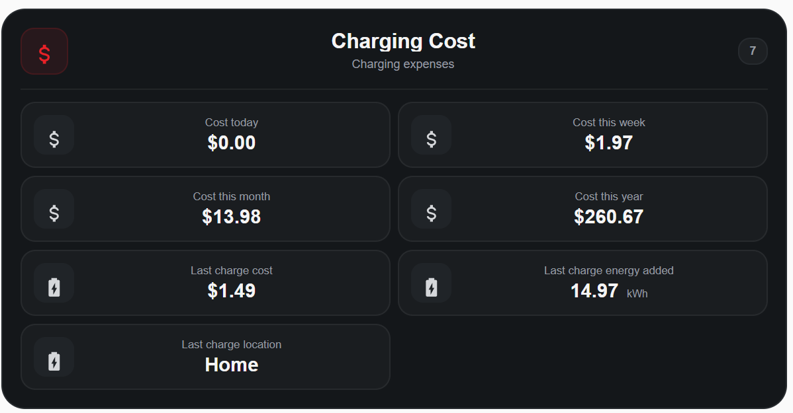

## Supercharging

Supercharger sessions, energy, costs, last Supercharger details, and invoice access information when available.

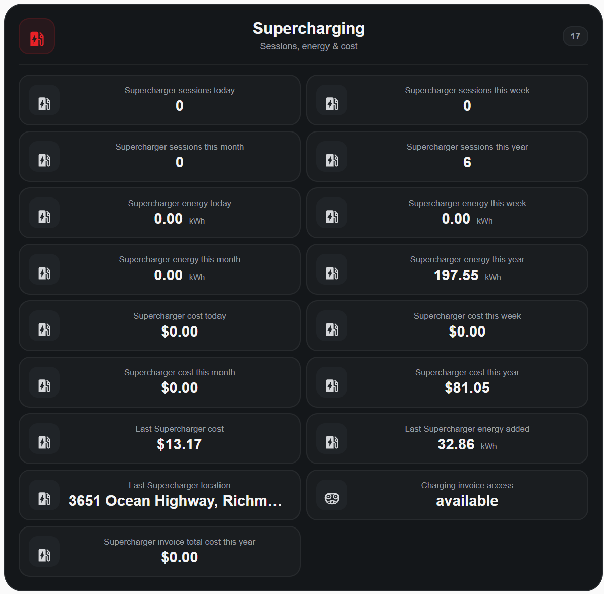

## Tires

All four tire pressures plus low-pressure warning binary sensors.

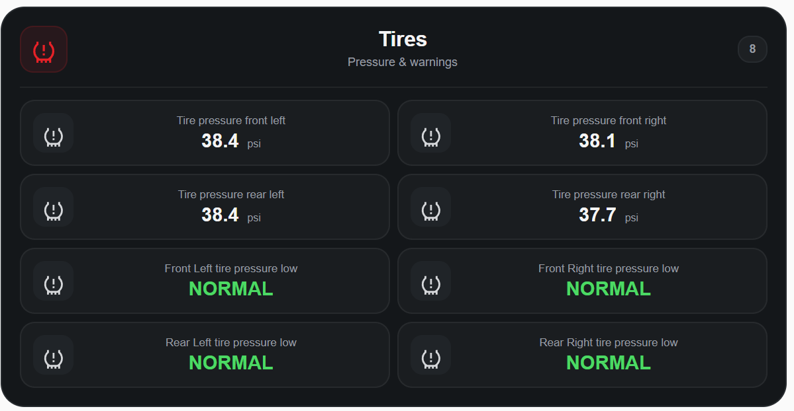

## Navigation

Active Tesla navigation destination, distance, ETA, traffic delay, and estimated battery at arrival.

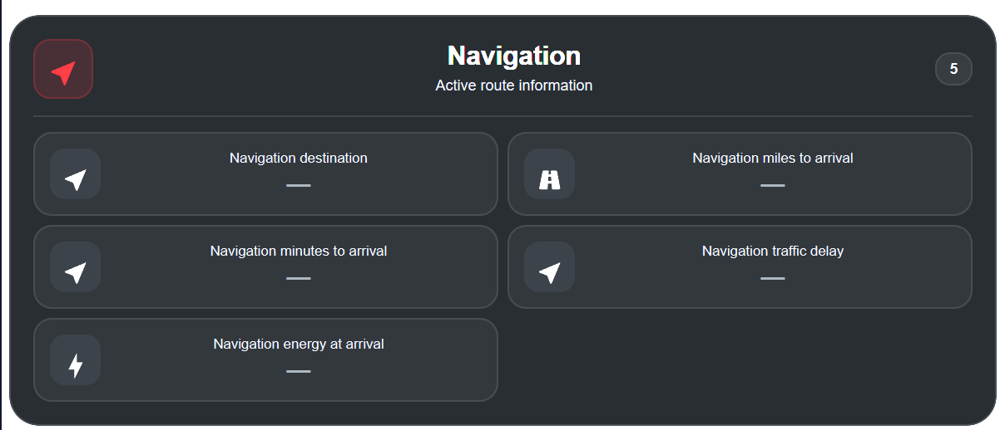

## Software

Tesla software version, update state/progress, firmware alerts, latest alert timestamp, and observed wakeups.

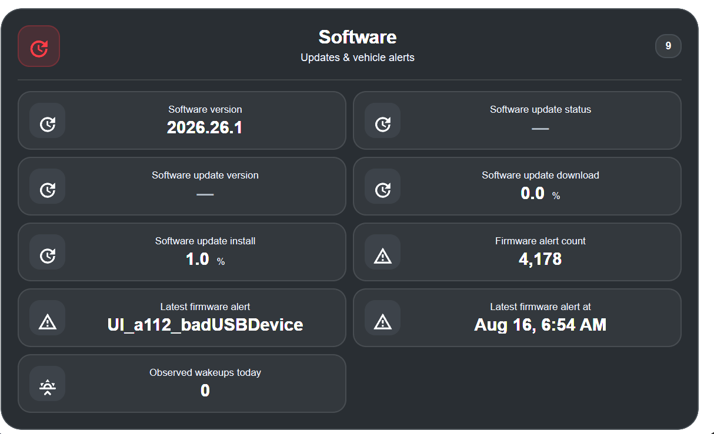

## Screenshot file naming

Use short, descriptive, lowercase filenames that match the visible card title. Examples:

- `vehicle.png`
- `driving-this-month.png`
- `last-drive.png`
- `drivefactors.png`
- `since-last-charge.png`
- `lifetime.png`
- `idle-this-year.png`
- `charging-cost.png`
- `software.png`

Avoid timestamp-based names such as `Screenshot 2026-08-16 120542.png`.
